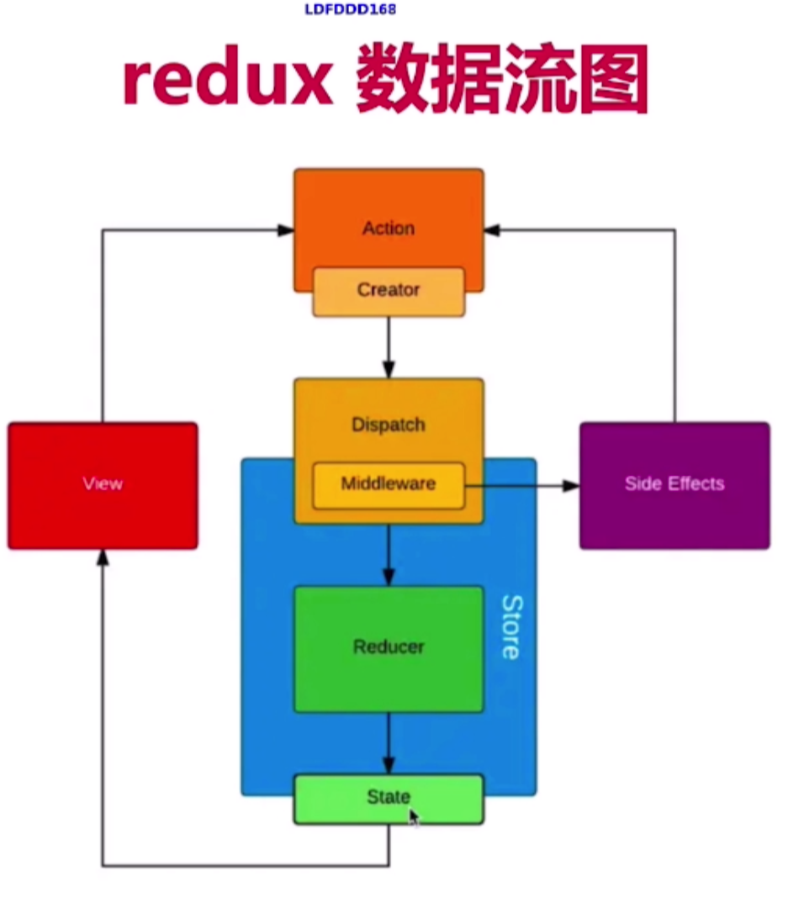
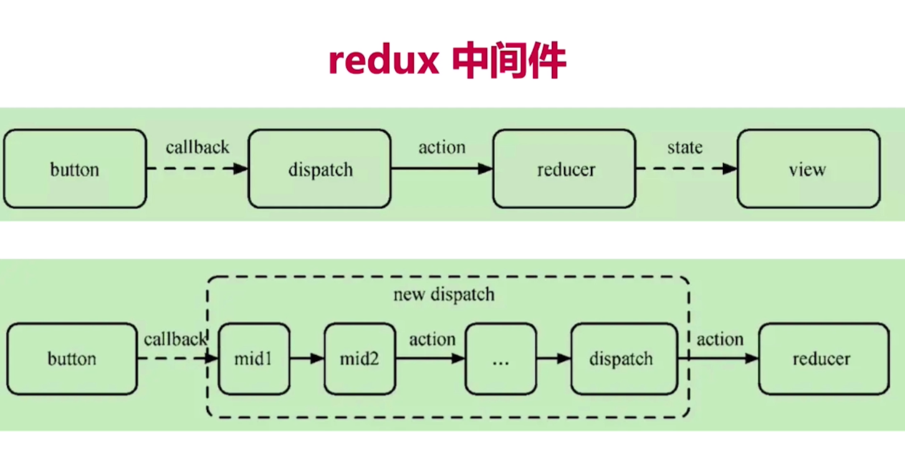

# react使用

- 基本使用
- 高级特性
- redux和react-router

#### React vs Vue

- 一样重要 两者都会
- 很多相通 正在趋于一致
- React比vue学习成本高，尤其对于初学者

#### react面试题回顾 开胃菜
- React组件如何通讯
- jsx本质是什么
- context是什么，有何用途
- shouldComponentUpdate用途
- redux单项数据流（重要）
- setState同步异步？

#### event

- bind this

	- this,默认是undefined,bind this改this指向
	- 内联绑定，每次都要执行一次，在constructor只绑定一次
	- 静态方法 handle = ()=>{}
	
- 关于event参数
	- event不是原生的event是组合事件`SyntheticEvent` 原生的是MouseEvent，但是模拟dom事件所有能力
	- `event.__proto__.constructor`是个class
	- 原生的event在 `event.nativeEvent`
	- (vue 的event是原生的，事件挂载到当前元素和dom一样)
	- react的`event.target`是在当前元素，但是绑定的`event.currentTarget`是document
- 传递自定义参数
	- 不主动传 默认最后一个接受event

#### 表单
- 受控组件 表单的值 受state控制，类似双向数据绑定
- input textarea select

#### 父子组件传值
- props
	- props传递数据
	- props传递函数（）
		> vue中通过父组件@a=handle传给子组件 子组件$emit('a')来调用父组件，其实是观察者模式，父@监听子组件a，
		> react通过传递function  
	- props类型检查 prop-types

#### setState!!重要

- 不可变值！(函数式编程，纯函数的概念) 不能直接操作state的值
	- state在构造函数中定义
	- 不要直接修改state,使用不可变数据！
		
		```
		 this.state.count++ 错误！
		 this.setState({
			 count: this.state.count + 1
			 })
		```
	- 假如操作的是 object array等引用类型
		- concat slice filter [...]可以 但是push pop splice不行
		- 不能对this.state.obj进行属性赋值 
		```
		 this.state.count++ 错误！
		 this.setState({
			 obj: {...obj,a:100}
			 })
		```
- 可能是异步更新 为什么？？
	```
	异步
		this.setState({
		count: this.state.count+1
		},()=> {
			console.log(this.state.count)//最新值
		})
		console.log(this.state.count）//拿不到最新
	//setTimeout中是同步
	setTimeout(()=>{
		this.setState({
			count: this.state.count+1
		},()=> {
			console.log(this.state.count)//最新值
		})
		console.log(this.state.count）//能拿到最新
	})
	//自己定义的DOM事件是同步的
		document.body.addEventListener('click',handler)
	function handler(){
		this.setState({
			count: this.state.count+1
		})
		console.log(this.state.count）//能拿到最新
	}
	```
- 可能会被合并

	```
	<!--setState传入对象 只会执行一次 +1-->
	this.setState({
		count: this.state.count + 1
	})
	this.setState({
		count: this.state.count + 1
	})
	
	<!--传入函数不会合并 +2  函数不能合并-->
    
	this.setState((prevState) => {
		count: prevState.count + 1
	})
	
	```

#### 声明周期
[生命周期](http://projects.wojtekmaj.pl/react-lifecycle-methods-diagram/)

- 父子组件生命周期和vue一样


#### 高级特性
1. 不常用但是用的时候知道，
2. 考察掌握全面 且有深度
3. 做过的项目是佛㕛深度和复杂度


- **函数组件**
	- 纯函数 输入props 输出JSX 
	- 没有实例生命周期，state(hooks已经有了)
- **context**
	- 使用场景： 公共信息（语言 主题）传递给每个组件
	- props太繁琐 redux太小题大做
- **非受控组件**(input的值不受state控制)
	- 使用场景：必须手动操作DOM，setState实现不了 文件上传，富文本编辑器
	- `ref`
	- `defalutValue defaultChecked`
	- 手动获取DOM
	
	```
		    this.fileInputRef = React.createRef() // 创建 ref
	        <input type="file" ref={this.fileInputRef}/>
	        const elem = this.fileInputRef.current.value // 通过 ref 获取 DOM 节点   不是state.name    
	```
- **Portals**
	- 将组件渲染到父组件之外
	- 使用场景： 父组件 overflow:hidden, 父组件z-index太小，fixed需要放在body第一层级
- **性能优化**
	- 性能优化对于React比vue更加重要
	- setState值的不可变性
	- `PureComonent` `React.memo` 浅比较
	-  immutable.js
		- 彻底拥抱“不可变值”  
		- 基于共享数据（不是深拷贝） 速度快 
		- 有学习和迁移成本
	- `shouldComponentUpdate` return true可以渲染
		- 默认return true 可定制
		- react为什么加这个？ react为什么不直接加对比？
			- 	深度比较(lodash.isEqual() `耗时`)假如使用者不规范的用push等更改数据，nextProps和props已经一样了，SCU就一直返回false,就不会更新了就造成了bug
		- react默认父组件有更新，子组件无条件更新（SCU默认true）
- **异步组件**
	- import()
	- React.lazy React.Suspense
- **组件公共逻辑的抽离**
	- mixin 已被弃用

	- **高阶组件HOC** 
		- 不是一种功能 而是一种模式
		- 接受一个组件 返回一个新组件
		
		```
		// 高阶组件
			const withMouse = (Component) => {
			    class withMouseComponent extends React.Component {
			        constructor(props) {
			            super(props)
			            this.state = { x: 0, y: 0 }
			        }
			  
			        handleMouseMove = (event) => {
			            this.setState({
			                x: event.clientX,
			                y: event.clientY
			            })
			        }
			  
			        render() {
			            return (
			                <div style={{ height: '500px' }} onMouseMove={this.handleMouseMove}>
			                    {/* 1. 透传所有 props 2. 增加 mouse 属性 */}
			                    <Component {...this.props} mouse={this.state}/>
			                </div>
			            )
			        }
			    }
			    return withMouseComponent
			}
		```
		- redux中connect就是高阶组件
		
		```
		const VisibleTodoList = connect(mapStateToProps,mapDispatchToProps)(TodoList)
		```
		
		```
		//connect源码：接受2参数 返回一个函数，该函数在接受一个组件返回新组件
		export const connect = (mapStateToProps,mapDispatchToProps) => (WarppedComponent) => {
			return class Connect extends Component {
				render() {
				return <WarppedComponent/>
				}
			}
		}
		```
	- **RenderProps**
		- 通过一个函数（render或者children）将state最为props传递给子组件 
		- props render模式实现登录逻辑复用功能
	
	### Redux
	
	- vuex作用相同，但是比vuex学习成本高
	- 不可变值 纯函数
	- 基本概念
		- store state
		- action
		- reducer
	- 单向数据流
		
		- dispatch(action)
		- 通过reducer ->产生新的 newState
		- subscribe 触发通知
		- vue中（dispatch action -> commit mutations -> mutate State -> render components）
		
		
		- view触发 action -> dispatch (可能有middleware产生副作用 有可能再次触发action) -> Reducer -> 返回新的state-> view
	- react-redux
		- provider 
		- connect
		- mapStateToProp mapDispatchToProp
	- 异步action
	
		```
			//同步action 直接返回一个对象
			const addtodo = text => {
				return {
					type: 'ADD_TODO',
					text
				}
			}
			//异步返回一个函数 函数dispatch一个action
			const addtodoAsync = text => {
				return (dispatch) => {
					fetch(url).then(res => {
						dispatch(addtodo(res.todo))
					})
				}
			}
		```
	- 中间件 
		
		- 原理 
		- 对dispatch做改造
		- 比如redux中间件-logger实现
		
		```
			let next = store.dispatch
			store.dispatch = function dispatchAndLog(action) {
				console.log('dispatch', action)
				next(action);
				console.log('next state', store.getState())
			}
		```

### redux-router

- hash history
- 路由配置 动态路由 懒加载

### 总结

- 基本使用
- 高级特性
- redux router
- 组件通讯
- jsx本质
- context是什么 有何用途
- shouldComponentUpdate用途 -性能优化
- 描述redux单项数据流
- setState同步异步？ 原理？为什么


