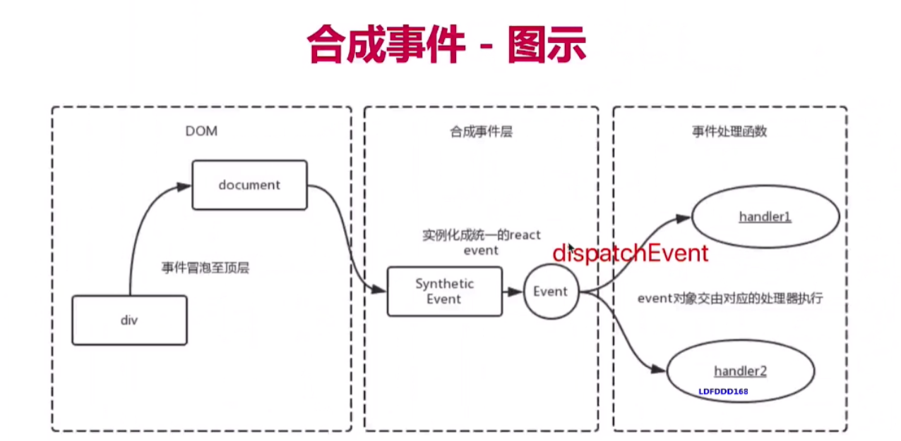
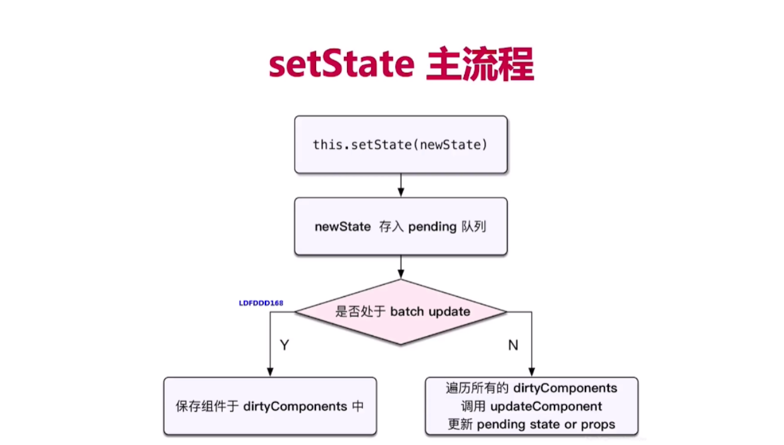
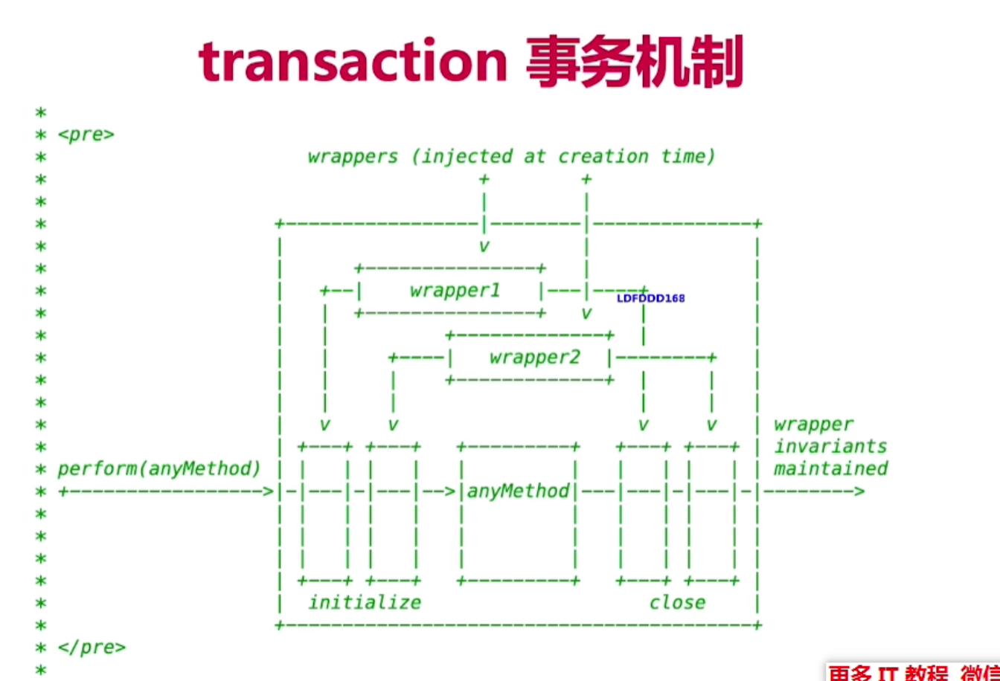

# react原理

- 大厂用react概率更高 
- 对开发人员要求更好
- 大厂更偏爱原理

### 如何考察react原理
- 重点而不是细节2/8原则
- 使用相关联的原理 例如 vdom JSX setState
- 整体流程是否全面，热门技术是否有深度

### react原理
- **函数式编程** 一种编程范式
	- 纯函数
	- 不可变值
- **vdom 和diff**
	- h函数
	- vnode数据结构
	- patch函数
	- 只比较同一层级 不跨级比较
	- tag不同 直接重建不再深度比较
	- tag和key相同则认为是相同节点，不再深度比较
	- vue2.x使用的`snabbdom`库，vue3.0优化静态节点直接不比较，React...核心概念和实现思路一样
- **jsx本质**
	-  jsx等同于Vue模板 vue模板不是html 是函数

	```
	<!--通过React.createElement实现的-->
	<!--React.createElement 是h函数，返回vnode，再通过patch来渲染-->
	<!--第一个参数是字符串 html tag, 或者变量组件（组件名首字母大写）-->
	<!--第二个是属性-->
	<!--第三个参数可以使数组，或者后面所有参数都作为子元素-->
	React.createElement('div'{
		id:'id1'
	}, React.createElement('img'),{
		src: img
	},React.createElement(List),{
		src: img
	})
	```
- **合成事件 ！！**
	- 所有时间挂载到document上
	- event不是原生的，是`SyntheticEvent合成事件`对象
	- 和vue事件不同，和DOM事件也不同
	
	- 为什么用合成事件？
		- 更好的兼容性和跨平台
		- 挂载到document，减少内存消耗，避免频繁解绑
		- 方便事件的统一管理（如事务机制）
- **setState batchUpdate ！！**
	
	- 有时异步（普通使用），有时同步（setTimeout DOM事件）
		- 看是否命中batchUpdate机制， 看isBatchingUpdatas
	- 有时合并（对象） 有时不合并（函数形式）
	- **setState主流程**
		- setState后把newState放入pending队列
		- 判断是否处于batch update？？(怎么判断)
			- 是的话（异步）保存组件于dirtyComponents（state已经被更新的components）
			- 不是的话（同步） 遍历所有dirtyComponents 调用updatecomponent 更新pending state or props
		
	- **batchUpdate机制**
		- 函数中开始执行 isBatchingUpdates = true
		- 结束isBatchingUpdates = false
		- 遇到setTimeout（DOM事件） 异步时 此时isBatchinUpdate为false
		
		- 那些能命中batchUpdate机制？
			- 生命周期（和它调用的函数）
			- React中注册的事件（和它调用的函数）
			- React可以管理的入口
		- 不能命中batchUpdate机制
			- setTimeout setInterval等（和它调用的函数）
			- 自定义DOM事件
			- React ‘管不到’的入口
	
	- **transaction（事务）机制**
	
	
	
	```
		transaction.initialize = function() {
			console.log('initialize')
		}
		transaction.close = function() {
			console.log('close')
		}
		function method() {
			console.log('do something')
		}
		transaction.perform(method)
	```
- **组件渲染和更新过程!**
	- JSX如何渲染页面
		- jsx即createElement函数，
		- render生成vnode
		- patch(ele,vnode) patch(vnode,newVnode)
		
	- setState之后如何更新页面
		-  setState(newState) -->生成 dirtyComponents（可能有子组件）
		-  遍历所有的dirtyComponents render()生成newVnode
		-  patch(vnode,newVnode)
			- patch被拆分两个阶段
				1. reconciliation(协调)阶段 - 执行diff算法 纯js计算	
				2. commit阶段 -将diff结果渲染DOM
- **react-fiber**
	
	- 问题：性能瓶颈
		- js是单线程，且DOM渲染共用一个线程
		- 当组件足够复杂，组件更新时计算和渲染的压力都很大
		- 同时如果再有DOM操作要求（动画拖拽） 会卡顿
	- 解决方案（fiber）
		- 将reconciliation（协调）阶段进行任务拆分 （commit无法拆分 因为是dom渲染）
		- DOM需要渲染的时候 暂停，空闲时恢复
		- 什么时候知道dom需要渲染？window.requestIdleCallback
- **前端路由**

## 真题

1. 组件如何通讯
	- props
	- 自定义事件
	- redux context

2. JSX本质
	- createElement
	- 执行返回vnode

3. context 是什么应用
	- 父组件想所有子组件传递信息
	- 语音主题色
4. SCU用途
	- 性能优化
	- 配合不可变值 一起使用
5. redux单项数据流
6. setState场景题 同步异步
7. 纯函数
	- 返回一个新值，没有副作用（不会‘偷偷’修改其他值）
	- 不可变值
8. 组件生命周期
	- 单组件
	- 父子组件
9. axax放在哪个生命周期
	- 同vue cdm
10. 列表渲染为何用key
	- 同vue 
	- dom diff通过tag和key判断是否是sameNode
11. 函数组件和class区别
	- 纯函数输入props输出JSX
	- 没有实例，没有生命周期，没有state(hooks引入后有了)
	- 不能扩展其他方法
12. 受控组件
	- 表单的值受state控制
	- 需要自行监听onChange更新state
13. 对比非受控组件 上传文件
14. 合适使用异步组件
	- 大组件
	- 路由懒加载
15. 公用逻辑抽离
	- mixin 废弃
	- HOC
	- render props
	- hooks
16. redux如何进行异步请求
	- 使用异步action
	- 同步action返回一个对象，异步返回一个函数，函数进行异步请求之后 dispatch一个action
	- redux-thunk
17. router如何配置懒加载
18. PureComponent有何区别
	- 实现了浅比较的shouldComponentUpdate
	- 结合不可变值使用
19. React事件和DOM事件区别
	- 所有事件挂载到document
	- event不是原始的 合成事件
	- dispatchEvent
20. react性能优化
	- 渲染列表使用key
	- 自定义事件 DOM事件及时销毁
	- 合理使用异步组件
	- 减少函数bind this次数
	- 合理使用SCU PureComponent memo
	- 合理使用Immutable.js
	- webpack层面
	- 前端通用的性能优化
	- SSR
21. 


