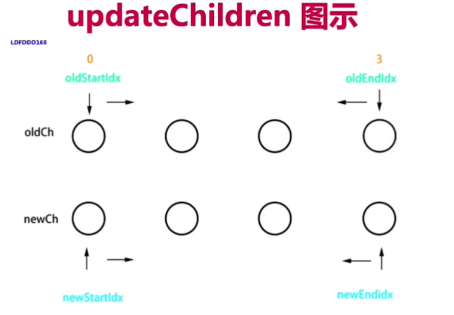
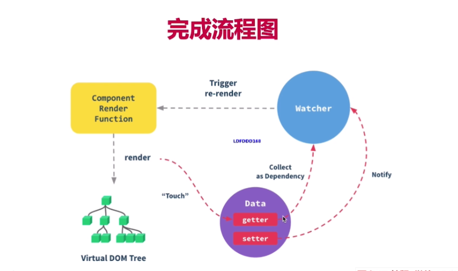

## 原理

- 为何考核原理
    - 知其然知其所以然
    - 竞争激烈 择优录取
    - 造轮子（有钱有资源， 业务定制， 技术KPI）
- 如何考核 以什么方式
	- 考察重点，而不是太细节  2/8原则
	- 和使用相关的原理  vdom /模板渲染
	- 整体流程是否全面 热门技术是否是深入
- vue原理有哪些
	- `组件化`
	- `响应式`
	- `vdom diff`
	- `模板编译`
	- `组件渲染过程 更新过程`
	- `前端路由`


#### 组件化基础
- 很久以前 就有组件化
	- jsp php 
	- nodejs
- 数据驱动视图 Vue MVVM 
- 数据驱动视图 React setState

#### vue响应式原理
- 组件data的数据一旦变化，立即触发视图更新
- 实现数据驱动视图的第一步
- Object.defineProperty

	```
	let data = {}
	Object.defineProperty(data,'name',{
		get:function(){
		console.log('get')
		return name
		},
		set:function(newVal){
		console.log('set')
		name = newVal
		}
	})
	```
	- 监听对象
	- 复杂对象，深度监听
	- 如何监听数组？
	- 重写数组方法
	- 缺点 
		- 深度监听，需要一次递归到底
		- 无法监听新增 删除属性（Vue.set Vue.delete） 
		- 无法监听数组 需要特殊处理
- vue3启用代理 proxy(有兼容性问题却无法polyfill)

### 虚拟DOM(virtual DOM) 和diff 重要
- vdom是实现vue和React的重要基石（数据驱动视图 dom操作耗费性能、实现跨平台）
- js模拟DOM结构
```
{
tag: 'div',
props: {
    id: 'div1',
    className:'class1'
},
children:[{
    tag: 'ul',
    props: {
        style: 'font-size:20px'
        }
    },
    children: [{
        tag:'li',
        text: 'hello'
    }]
    ]
}
```
- 通过snabbdom学习 vdom和 diff（vue参考的它实现的vdom）
- vnode核心概念 ： h(返回vnode) vnode patch diff key
- patchVNode
- addVnodes removeVnodes
- updateChildren key的重要性  这个是snabbdom的算法细节不能不是vuereact等的


#### diff

- diff算法是vdom中最核心，最关键的部分
- key是为了diff算法作比较
- 对比vdom找出最新的更新范围
- jiff 比较两个js对象
- 树的diff的时间复杂度是0(N^3) 1 遍历tree1 2遍历tree2 3.排序 遍历三次 1000个节点就要计算一亿次
- 优化时间复杂度到 0（n） 1000个节点计算1000次

1. 只进行同级比较 第一级 和第一级 第二级和第二级
2. tag不同直接删掉重建不进行深入比较
3.  tag和key都相同则认为是同一节点，不再深度比较。


### 模板编译

- 它不是html 有指令 插值 js表达式
- 模板一定是通过转换成某种js代码，即模板编译
- 面试通过 `组件渲染和更新的过程`来考

        - vue template compiler将模板编译为render函数
        - 执行render函数生成vnode
        - 基于vnode再执行patch和diff
        - 使用webpack vue-loader 会在开发环境下编译模板
    
- js with语法 (延长作用域链的长度)

```
将{}内的自由变量当初obj的属性查找
 with(obj){
console.log(c)// 相当于 obj.c
}
```


- vue-template-compiler

```
const compiler = require('vue-template-compiler');
const template=`<p>{{message}}</p>`
//编译
const res = compiler.compile(template)
console.log(res.render)
//with(this){return_c('p',[_v(_s(message))])}
// _c -v -s message 都是查找的this 
// -v -> createTextNode  -c -> createElement -s -> toString -c就是h函数 ，执行返回的是vnode
// -l renderList
```
### 组件渲染/更新过程



- 初次渲染过程
    - 解析模板为render函数（或在开发环境通过vue-loader已完成）
    - 触发响应式，监听data属性 getter setter
    - 执行render函数，生成vnode，patch(elem,vnode)
- 更新过程
    - 修改data, 触发 setter
    - 重新执行render函数，生成newVnode
    - patch(vnode,newVnode)
- 异步渲染
    - $nexttick  dom渲染完再执行回调
    - 汇总data修改，一次性更新视图
    - 减少DOM操作次数，提高性能


总结： 响应式 模板渲染 vdom


### 路由原理

 > 一般就是浏览器发出请求（url变化）--> 服务器监听80（443）端口的请求，解析url --> 根据服务器的路由配置，返回相应的信息（html, json等）--> 浏览器根据content-type决定如何解析
- hash 

    - 通过hashchange改变触发跳转
    - 不会刷新页面
    - 永远不会向后端发起请求 不会提交到server端（前端自生自灭的东西）
- history 
    - pushState replaceState 
    - popstate  仅仅调用pushState()方法或replaceState()方法 ，并不会触发该事件，只有用户 点击浏览器倒退按钮和前进按钮，或者使用 JavaScript 调用 **History.back()、History.forward()、History.go()** 方法时才会触发
    - pushState()方法不会触发页面刷新，只是导致 History 对象发生变化，地址栏会有反应。
    
    

## 真题

- v-show 和 v-if区别

 	- v-show 控制css  v-if组件真正的渲染和销毁
 	- 频繁切换用v-show

- 为何 v-for中的key
	
	- 必须是key 不能是index和random 
 	- diff算法中tag和key来判断是否是sameNode
 	- 减少渲染测试，提升渲染性能

 - 生命周期
 		```
 		create mount update destory
 		```
```
 - 父子组件的生命周期

 		- index created -> list created -> list mounted -> index mounted 创建过程从外到内，渲染过程从内到外
 		- index before update -> list before update -> list updated -> index updated
		- 更新 也是 先从外到内，再从内到外 
- 组件通讯

	- 父子props this.$emit
	- 自定义事件eventbus  event.$on event .$emit
	- vuex
- 描述组件渲染更新过程


- 双向数据绑定v-model实现原理(自己实现)

	- input元素的value = this.name
	- 绑定input时间 this.name = $event.target.value
	- data更新触发re-render

```
	<input 
		:value='text'
		@input='$emit("change",$event.target.value)'
	/>
	model: {
		props:'text',
		event: 'change'
	}
	```
- 对MVVM的理解


- computed有何特点
	
	- 缓存，data不变不会重新计算，提高性能

- 组件data为啥是个函数？

	- （vue到处后是个class）如果不是函数，那么每个组件的实例就共享了，都一样了

- ajax放在哪个生命周期
	- mounted 
	- 放在mounted之前没什么用，只会让逻辑更混乱

- 如何将组件所有props传递给子组件
	-  v-bind="$props"


- 多个组件相同逻辑如何抽离
	
- mixin
	
- 合适使用大的组件

	- 大组件
	- 路由异步加载

- 何时使用keep-alive

	- 缓存组件。不需要重复渲染
	- 多个静态tab页的切换
	- 优化性能

- 何时使用deforeDestory

	- 解绑自定义时间 $event.$off  
	- 清除定时器
	- 解绑自定义dom事件 scroll等，vue的事件不需要自己解除

- vuex中action mutation区别
	- action处理异步
	- mutation处理同步
	- mutation做原子操作 action可以整合多个mutation

- router
	- hash
	- history

- vnode描述一个dom结构

	```
	[{
		tag: 'div',
		props: {
			className: 'c',
		},
		children: [{
			tag: 'p',
			children: 'hello'
		},{
			tag:'ul',
			props: {
			},
			children:[{
				tag: 'li',
				children: 'xxxxx'
			}]
		}]
	}]
	```

- Object.defineProperty 深度监听 监听数组 缺点
- vue如何监听数组变化
	- Object.defineProperty不能监听数组变化
	- 重新定义原型，重写push方法等实现监听

- 描述响应式原理

- diff算法时间复杂度

	- O（n）
	- 在O（n^3）基础上做的调整   之比较同一层级  tag不同直接重建  tag和key

- 简述diff算法过程
	- `patch(elem,vnode)` 和`patch(vnode,newVnode)`
	- `patchVnode` 和addVnodes和removeVnodes
	- updateChildren(key重要性)
	
	1. patch 过程 patch 第一个参数如果是elem创建一个空的vnode关联到elem(emptyNodeAt),
	2. 对比sameVnode 如果不同，直接删掉重建 removeVnodes
	3. sameVnode=true(key sel), 则进行`patchVnode`
	4. 如果 vnode.children有值，
		1. 新 旧都有 children
			1. 新旧不等 更新children updateChildren
		2. 新的 children有  旧的无 addVnodes
		3. 旧的children有值 新的没值 removeVnodes
	5. vnode.text 有值 removeVnodes 设置新的text
	6. updateChildren过程 (oldStartIdx <= oldEndIdx && newStartIdx <= newEndIdx)
		1. 开始和开始对比
		2. 最后和最后对比
		3. 开始和结束对比
		4. 结束 和开始对比
		5. 以上都未命中 拿新节点的key能否对应上oldchildren的所有其他节点做对比
			1. key没有对应上的话 直接插入
			2. key 对应上了 
				1. tag相等 则patchVnode
				2. 不等则 直接插入 insertBefore


- vue为何是异步渲染 $nextTick有何用
	- 异步渲染（以及合并data修改），已提高渲染性能
	- $nextTick在DOM更新之后 触发回调（vue异步渲染没办法在data修改之后拿到dom变化）


- 常见性能优化
	- 合理v-show v-if
	- 合理利用computed
	- v-for 使用key 不适用v-if
	- 


