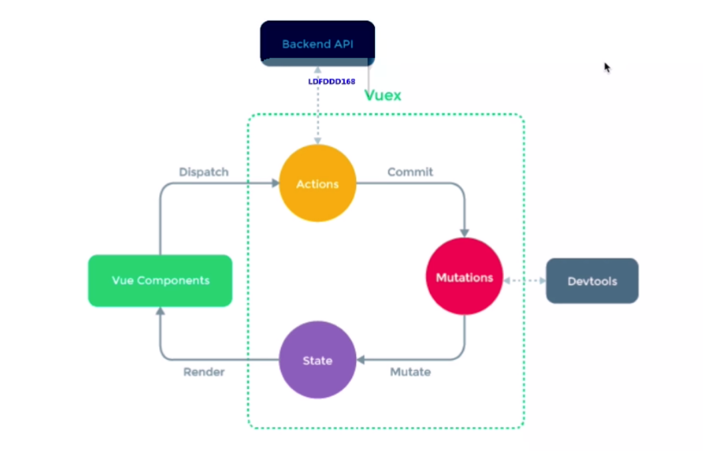

> vue react

- 基本使用
- 高级特性
- 原理

> webpack

- 配置
- 性能优化
- babel

> 项目设计

- 框架综合应用
	设计todolist（组件结构，redux state数据结构）
- vue设计购物车（组件结构 vuex state）

### vue
	
- v-show v-if
- v-for中使用key 
- 生命周期（父子组件情况）
- 组件通讯
- 描述组件渲染和更新的过程
- v-model的实现原理

### react

- 组件如何通讯
- jsx本质是什么
- context是什么 有何用途
- shouloComponentUpdate的用途
- redux单项数据流
- setState同步/异步

###webpack

- 前端代码为何打包构建
- module chunk bundle 什么意思区别
- loader plugin的区别
- 如何实现懒加载
- 常见性能优化
- Babel-runtime 和babel-polyfill区别

----------------------

## vue使用

- computed watch

	- computed 有缓存， data不变不会重新计算
	- watch如何深度监听? 

	```
	handler(){},
	deep:true

	```
	- watch监听引用类型 拿不到oldValue。因为指针相同，指向了新的value

- v-if v-show
	- v-show控制的css display:none
	- v-if是直接不渲染
	- v-show 更多的初始渲染，更少的切换
- v-for
	- `key`的重要性 不能乱写（random index）和业务相关联的
	- v-for 和v-if不能同时使用
		- v-for先工作，然后再v-if判断，会重复

- 事件

	> event是原生的，事件被挂在到当前元素	
	- event参数 ，自定义参数 $event
	- 事件修饰符
	- 观察 事件被绑定到哪里？


- 组件相关

	- props $emit

	- 兄弟组件间通讯 - 自定义事件/eventBus 
		- event.$emit('xx'); (event是一个vue的实例)
		- mounted阶段 event.$on('xx')
	
- 组件生命周期
	- 挂载
		- created 创建实例 并没有挂载
		- mounted挂载
	- 更新
	- 销毁
		- beforeDestory 销毁settimeout事件等
	- 激活 activited
- 父子组件生命周期 
	- index created -> list created -> list mounted -> index mounted
	- 创建过程是从外到内的， 渲染时从内到外的
	- index before update -> list before update -> list updated -> index updated
	- 更新 也是 先从外到内，再从内到外
- 高级特性
	- 自定义 v-model 
		- value $input语法糖
		- 可通过 model:{props:'',event:'change'}自定义
	- $nextTick
		-  VUE是异步渲染  
		-  页面渲染时会对data修改做整合，多次修改data只会渲染一次
		-  data渲染之后 DOM不会立即渲染,
		-  $nextTick 会在DOM渲染之后被触发，可获取最新DOM节点
	- slot
		- 作用域插槽 可以拿到子组件里面的东西
	
			```
			<Component>
				<template v-slot='slotProps'>{{slotProps.slotData.title}}</template>
			</Component>
			
			<!--子组件-->
			<slot :slotData='xx'></slot>
			```
		- 具名插槽
	- 动态 
	 	```
		 <component :is='components-name'/>
		 ```
	- 异步组件
		- import()函数
		- 按需加载，异步加载大组件
		```
		components: {
			Static,
			Avator: () => import('xxx')
		}
		```
	- keep-alive
		- 缓存组件 /频繁切换，不需要重复渲染
	- mixin
		- 多个组件抽离相同逻辑
		- 不完美有一些问题（1.变量来源不明确不利于阅读 2.命名冲突 3.多对多关系，复杂度较高）
		- vue3中 compositionAPI旨在解决这些问题
		- 先mixin mounted -> 再mine mounted
	- refs


### vuex使用

- state的数据结构设计？
- 概念state getters action mutation
- dispatch commit mapState mapGetters mapActions mapMutations
 
 
 - dispatch 一个actions 
 - action 请求后台接口 commit 多个原子mutations
 - mutations Mutate 修改 State （devtools）
 - render 到组件

### vue-router

- 路由模式 hash h5 history
    - history路由模式 后端需要配置
- 路由配置 动态路由 懒加载

## 原理

