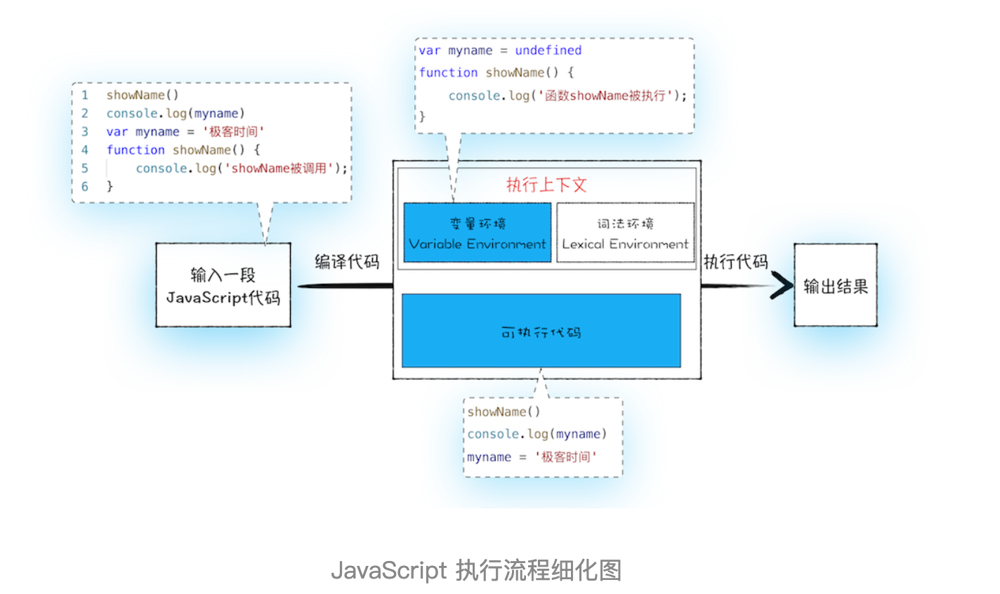
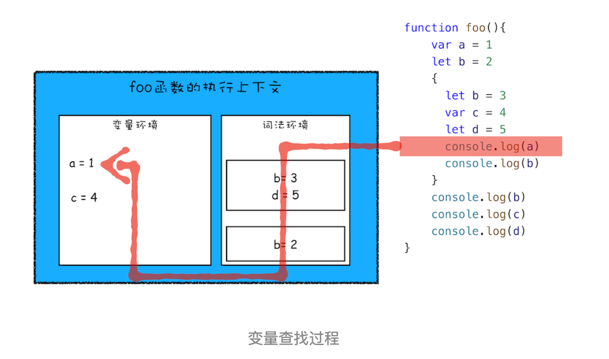
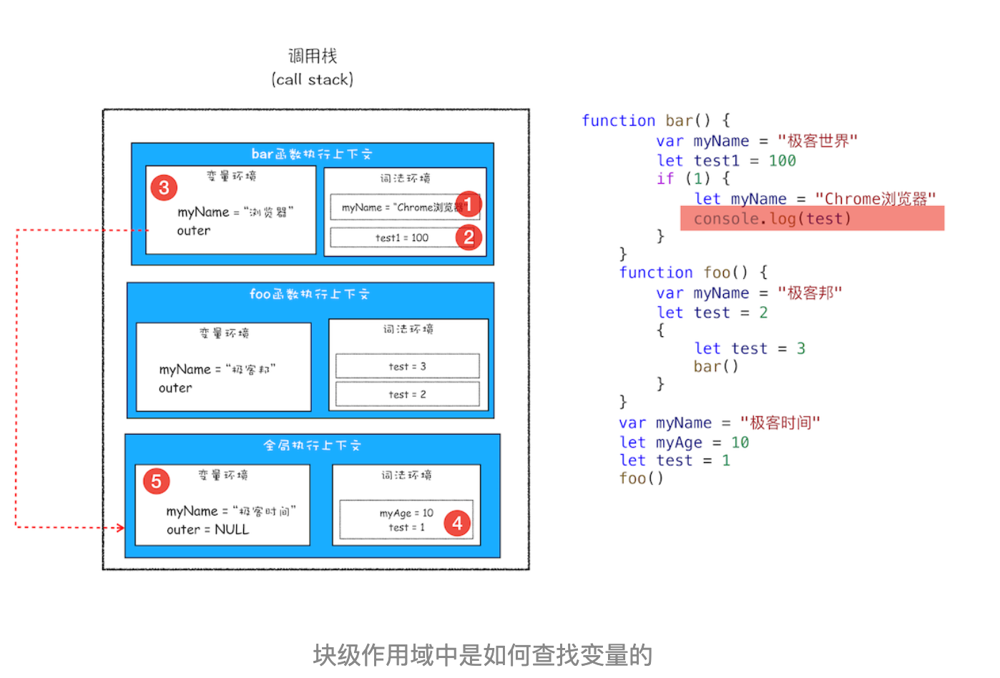
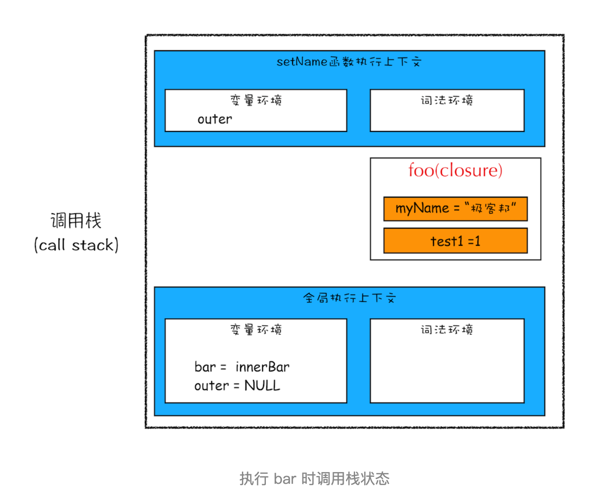
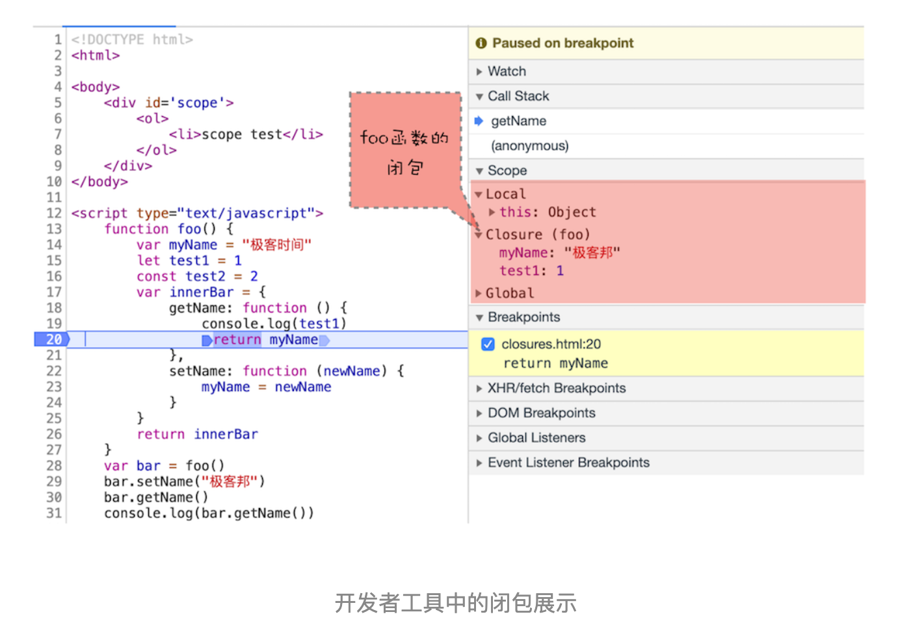
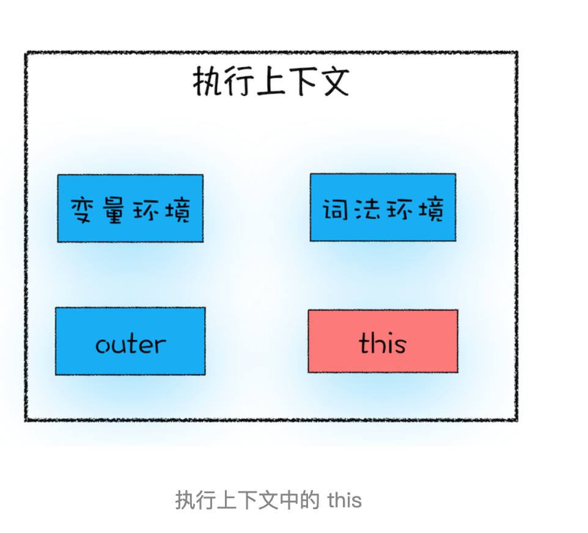

## 1变量提升：JavaScript代码是按顺序执行的

**变量提升hoisting**
	 
JavaScript 代码执行过程中，JavaScript 引擎把变量的声明部分和函数的声明部分提升到代码开头的“行为”。给变量默认undefined。

实际上变量和函数声明在代码里的位置是不会改变的，而且是在编译阶段被 JavaScript 引擎放入内存中。


```
graph LR
一段JS代码-->编译阶段-->执行阶段
```


- 1编译阶段

	输入一段代码，经过编译后，会生成两部分内容：**执行上下文（Execution context）和可执行代码**

	执行上下文是 JavaScript 执行一段代码时的运行环境，比如调用一个函数，就会进入这个函数的执行上下文，确定该函数在执行期间用到的诸如 this、变量、对象以及函数等。
	
```
showName()
console.log(myname)
var myname = '极客时间' //JavaScript 引擎将在环境对象中创建一个名为 myname 的属性，并使用 undefined 对其初始化；
function showName() { //将函数定义存储到堆 (HEAP）中，并在环境对象中创建一个 showName 的属性，然后将该属性值指向堆中函数的位置。
    console.log('函数 showName 被执行');
}
```

- 2执行阶段

	JavaScript 引擎开始执行“可执行代码”，按照顺序一行一行地执行。下面我们就来一行一行分析下这个执行过程

总结：

1. JavaScript 代码执行过程中，需要先做变量提升，而之所以需要实现变量提升，是因为 JavaScript 代码在执行之前需要先编译。
2. 在**编译阶段**，变量和函数会被存放到**变量环境**中，变量的默认值会被设置为 undefined；在代码**执行阶段**，JavaScript 引擎会从变量环境中去查找自定义的变量和函数。
3. 如果在编译阶段，存在两个相同的函数，那么最终存放在变量环境中的是最后定义的那个，这是因为后定义的会覆盖掉之前定义的。

```
showName()
var showName = function() {
    console.log(2)
}
function showName() {
    console.log(1)
}
```

答案：

```
编译阶段
var showName
function showName() {
	console.log(1)
}
执行阶段
showName() 1
再次执行showName()的话就是2 因为函数的引用已经变了
```
## 2调用栈：为什么JavaScript代码会出现栈溢出？

**调用栈：**调用栈就是用来管理函数调用关系的一种数据结构。

JavaScript 引擎会将执行上下文压入栈中，通常把这种用来管理执行上下文的栈称为执行上下文栈，又称调用栈。

可以通过console.trace() 或者浏览器断点查看call stack

**栈溢出：**调用栈是有大小的，当入栈的执行上下文超过一定数目就会报错

总结：

- 每调用一个函数，JS引擎会为其创建执行上下文，并把该执行上下文压入调用栈，然后 JS引擎开始执行函数代码。
- 如果在一个函数 A 中调用了另外一个函数 B，那么 JavaScript 引擎会为 B 函数创建执行上下文，并将 B 函数的执行上下文压入栈顶。
- 当前函数执行完毕后，JS 引擎会将该函数的执行上下文弹出栈。
当分配的调用栈空间被占满时，会引发“堆栈溢出”问题。

```
优化递归

function fibo(n) {
return n<2 ? 1 : fibo(n-1) + fibo(n-2)
}

1 迭代
function fibo(n) {
	let num1 = 1,num2=1,num3=0;
	if(n<3) {
		num3 = 1
	}
	for(let i = 3; i < n;i++){
		num3 = num1+num2
		num1 = num2
		num2=num3
	}
	return num3
}
2 尾递归优化
确保最后一步只调用自身，由于只存在一个调用栈，就不会发生栈溢出。
把所有用到的内部变量改写成函数的参数.

function F(n ,ac1=1,ac2=1){
	if (n <=1) return ac2
	return F(n-1,ac2,ac1+ac2)
}

3 改成记忆函数
 var fibo = function(){
var memo = [1,1];      //存储我们的结果隐藏在闭包中，当调用的时候首先先检查这个结果是否存在了
var fib = function(n) {
var result = memo[n];
if(typeof result !== 'number') {
result = fib(n-1) + fib(n-2);
memo[n] = result
}
return result;
};
return fib
}()

4.动态规划
function feibo(n){
var val = Array(n).fill(0)

if(n ===0 || n ===1) {
return 1
}
else{
val[0] = 1;
val[1] = 1;
for (var i = 2;i<n;i++){
val[i] = val[i-1] + val[i-2]
}
return val[n]
}
}
```

## 3块级作用域：var缺陷以及为什么要引入let和const？
​	JS的变量提升是通过执行上下文中的变量环境来实现的。
​	块级作用域是通过执行上下文中的词法环境的栈结构来实现的。两者结合就实现了同时支持变量提升和块级作用域。



## 4作用域链和闭包：代码中出现相同的变量，JavaScript引擎是如何选择的？

**词法作用域：**词法作用域就是指作用域是由代码中函数声明的位置来决定的，所以词法作用域是静态的作用域，通过它就能够预测代码在执行过程中如何查找标识符。
代码阶段就决定好的，和函数是怎么调用的没有关系

 JavaScript**作用域链**是由**词法作用域**决定的，而词法作用域是由**代码结构**来确定的。

 **块级作用域是如何查找变量的**



1. 在调用栈中，最顶层的词法环境栈的最顶层查找，
2. 词法作用栈没有，找变量环境，
3. 变量环境没有则去作用域链查找（每个执行上下文的变量环境中，都包含了一个外部引用，用来指向外部的执行上下文，**outer**）
4. 作用域链的词法环境
5. 作用域链的变量环境
6. 下一级作用域链

### 闭包（理解背后的原理来彻底理解闭包）
在 JavaScript 中，根据词法作用域的规则，内部函数总是可以访问其外部函数中声明的变量，当通过调用一个外部函数返回一个内部函数后，即使该外部函数已经执行结束了，但是内部函数引用外部函数的变量依然保存在内存中，我们就把这些变量的集合称为闭包。






如果该闭包会一直使用，那么它可以作为全局变量而存在；但如果使用频率不高，而且占用内存又比较大的话，那就尽量让它成为一个局部变量。

查找：local- Closure - global

## 5this：从JavaScript执行上下文的视角讲清楚this

作用域链和this是两套不同的系统，它们之间基本没太多联系。

this 是和执行上下文绑定的.


1. 全局中的this，严格模式下undefined 非严格模式window
2. 函数中的this
	1. 通过call apply改变this
	2. 通过对象方法 指向调用的对象
	3. 通过构造函数  this 其实就是新对象本身 也就是实例
	
3. eval中的this