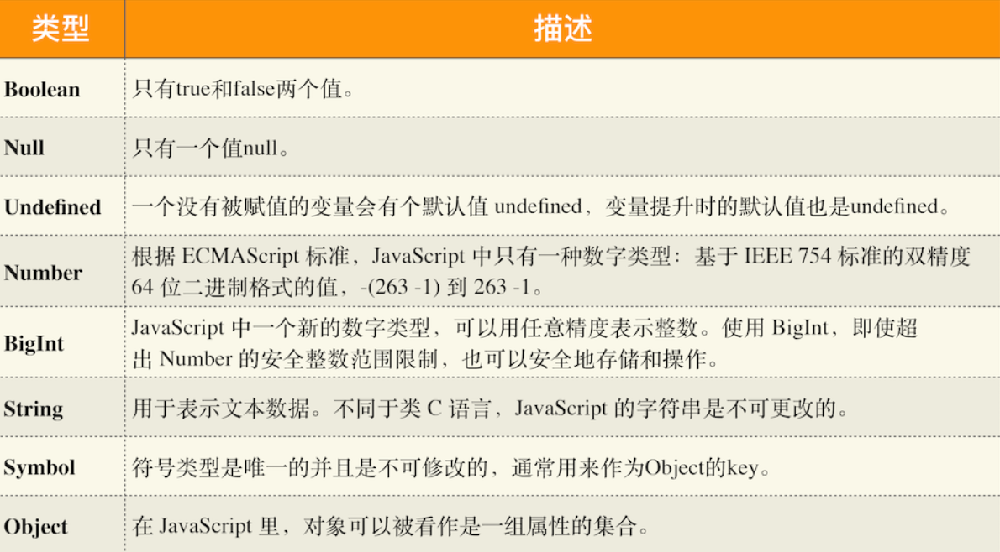
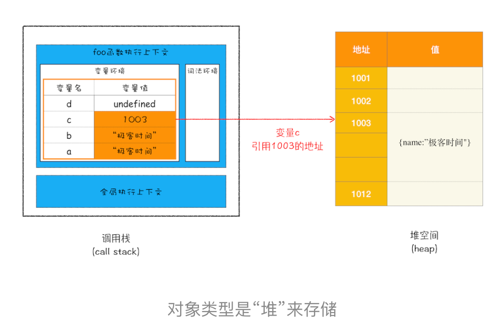
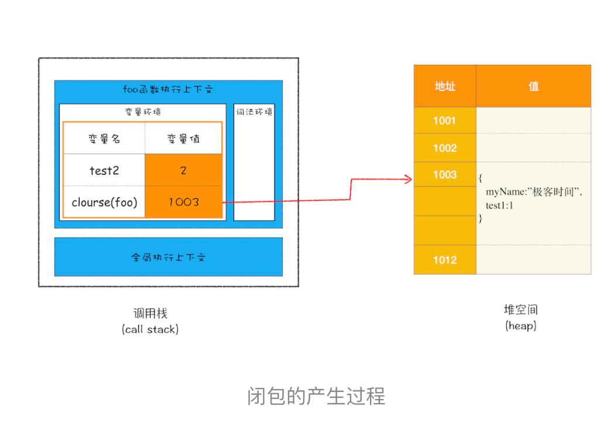
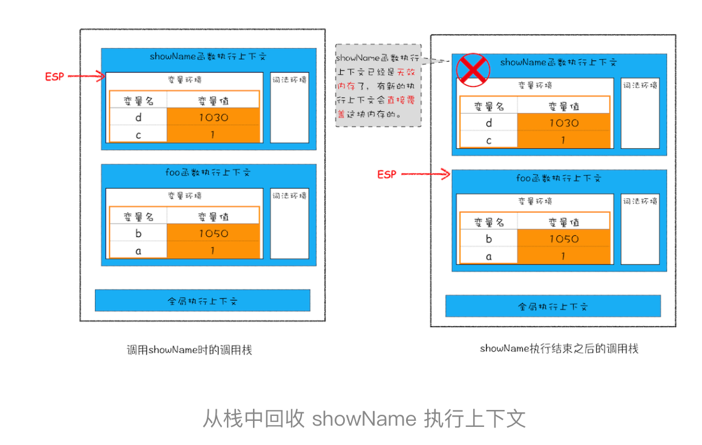
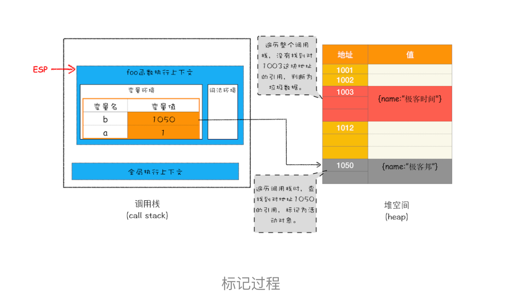
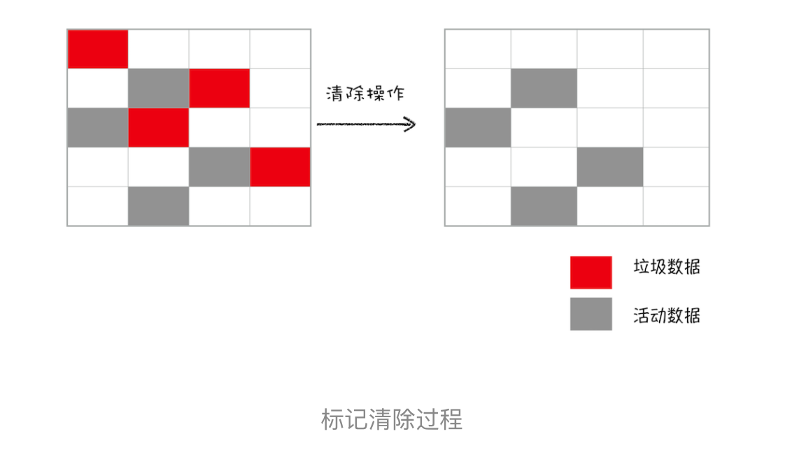
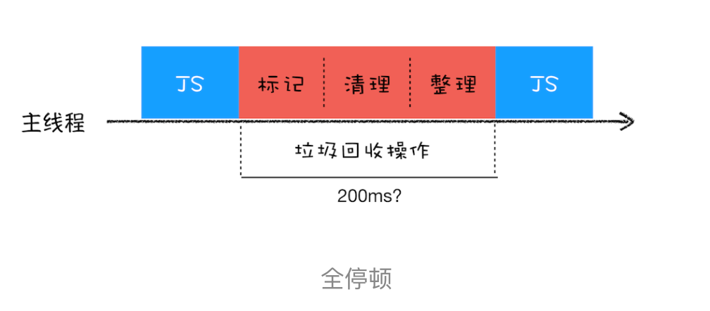
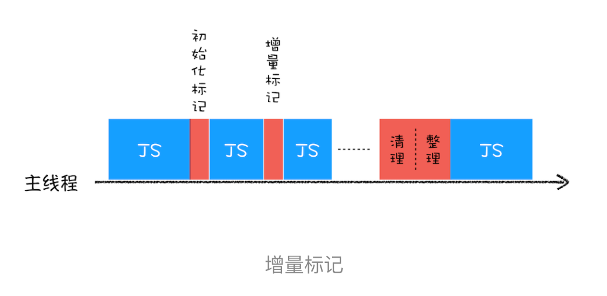
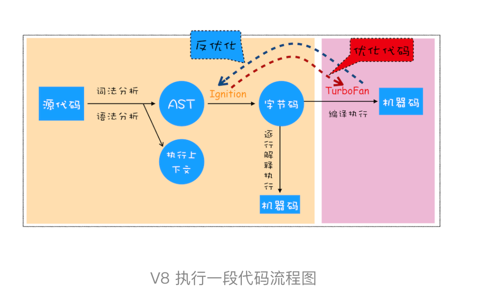
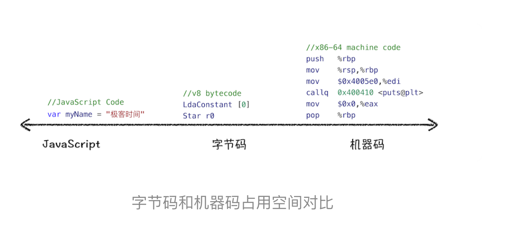

# V8工作原理

> 数据在内存中的存放、JavaScript 处理垃圾回收以及 V8 执行代码

## 数据是如何存储的：栈空间和堆空间

我们把这种在使用之前就需要确认其变量数据类型的称为静态语言,在运行过程中需要检查数据类型的语言称为动态语言.
支持隐式类型转换的语言称为弱类型语言，不支持隐式类型转换的语言称为强类型语言.

8种数据类型



1. typeof null  === 'object'  js的bug
2. typeof function (){} === 'function'
3. object类型是上述其中类型组成的`key-value`对的数据结构
4. 前7种类型为`原始类型` object为`引用类型`。数据存放的位置不一样。

#### 内存空间

在 JavaScript 的执行过程中， 主要有三种类型内存空间

1. `代码空间` 存放可执行的代码
2. `堆空间` 对象类型是存放在堆空间的，在栈空间中只是保留了对象的引用地址。
3. `栈空间` 调用栈 原始类型的数据值都是直接保存在“栈”中的 ，引用类型的值是存放在“堆”中的。

执行一段代码时，需要先编译，并创建执行上下文，然后再按照顺序执行代码


```
function foo(){    
	var a = "极客时间"    
	var b = a    
	var c = {name:"极客时间"}    
	var d = c}
	foo()
```

a,b变量直接保存在执行上下文的变量环境中，压栈。当执行到第四行，判断是个引用类型，将其分配到堆空间中，之后把地址放到环境变量中。


原始类型的数据值都是直接保存在“栈”中的 ，引用类型的值是存放在“堆”中的。

**Q:为什么非要分堆空间栈空间，到存在栈中不行么？**
	JS需要栈来维护程序执行期间上下文的状态，如果所有数据都放在栈中，栈空间过大，影响上下文切换效率，继而影响程序**执行效率**。通常情况下，栈空间都不会设置太大，主要用来存放一些原始类型的小数据

#### 内存模型的角度来分析闭包

闭包产生过程

```
function foo() {
    var myName = " 极客时间 "
    let test1 = 1
    const test2 = 2
    var innerBar = { 
        setName:function(newName){
            myName = newName
        },
        getName:function(){
            console.log(test1)
            return myName
        }
    }
    return innerBar
}
var bar = foo()
bar.setName(" 极客邦 ")
bar.getName()
console.log(bar.getName())
```

1. 由于变量 myName、test1、test2 都是原始类型数据，所以在执行 foo 函数的时候，它们会被压入到调用栈中；当 foo 函数执行结束之后，调用栈中 foo 函数的执行上下文会被销毁，其内部变量 myName、test1、test2 也应该一同被销毁。
2. 当 foo 函数的执行上下文销毁时，由于 foo 函数产生了闭包，所以变量 myName 和 test1 并没有被销毁，而是保存在内存中

那么应该**如何解释这个现象**呢？

1. 当 JavaScript 引擎执行到 foo 函数时，首先会编译，并创建一个空执行上下文。
2. 编译过程中，遇到内部函数 setName，JavaScript 引擎还要对内部函数做一次快速的词法扫描，发现该内部函数引用了 foo 函数中的 myName 变量，由于是内部函数引用了外部函数的变量，所以 JavaScript 引擎判断这是一个`闭包`，于是在`堆空间`创建换一个“closure(foo)”的对象（这是一个内部对象，JavaScript 是无法访问的），用来保存 myName 变量。
3. 着继续扫描到 getName 方法时，发现该函数内部还引用变量 test1，于是 JavaScript 引擎又将 test1 添加到“closure(foo)”对象中。这时候堆中的“closure(foo)”对象中就包含了 myName 和 test1 两个变量了
4. 由于 test2 并没有被内部函数引用，所以 test2 依然保存在调用栈中


当执行到 foo 函数时，闭包就产生了；当 foo 函数执行结束之后，返回的 getName 和 setName 方法都引用“clourse(foo)”对象，所以即使 foo 函数退出了，“clourse(foo)”依然被其内部的 getName 和 setName 方法引用。所以在下次调用bar.setName或者bar.getName时，创建的执行上下文中就包含了“clourse(foo)”。

产生闭包的核心有两步：第一步是需要预扫描内部函数；第二步是把内部函数引用的外部变量保存到堆中。

#### 深拷贝

```
function copy(dest){
  if(typeof dest === 'object'){
    if(!dest) return dest; // null
    var obj = dest.constructor(); // Object/Array
    for(var key in dest){
      obj[key] = copy(dest[key])
    }
    return obj;
  } else {
    return dest;
  }
}
```

## 垃圾数据是如何自动回收的

垃圾回收分为 `手动回收`如c 和`自动回收`如js java python。

```
function foo(){ 
    var a = 1 
    var b = {name:"极客邦"} 
    function showName(){ 
    var c = "极客时间" 
    var d = {name:"极客时间"} } 
    showName()
}
foo()
```

#### 调用栈中的数据是如何回收的

函数执行结束之后，foo 函数的执行上下文会从堆中被销毁掉，那么它是怎么被销毁的呢？

 **ESP** ： 记录当前执行状态的指针



    当一个函数执行结束之后，JavaScript 引擎会通过向下移动 ESP 来销毁该函数保存在栈中的执行上下文。

#### 堆中的数据是如何回收的

虽然函数下移ESP指针，函数的执行上下文失效。但是保存在堆中的数据依旧占着内存。要回收这些数据需要JS的`垃圾回收器`。

##### 代际假说和分代收集

垃圾回收的策略都是建立在代际假说的基础之上的。

代际假说特点：
    - 第一个是大部分对象在内存中存在的时间很短，简单来说，就是很多对象一经分配内存，很快就变得不可访问；
        - 第二个是不死的对象，会活得更久。

在 V8 中会把堆分为`新生代`和`老生代`两个区域，新生代中存放的是生存时间短的对象（通常只支持 1～8M），老生代中存放的生存时间久的对象。

**副垃圾回收器，主要负责新生代的垃圾回收。**

**主垃圾回收器，主要负责老生代的垃圾回收。**

#### 垃圾回收器的工作流程

**V8 把堆分成两个区域——新生代和老生代**。它们都有一套共同的执行流程。

1.  标记活动对象和非活动对象。 活动对象还在使用，非活动对象可以回收的对象。
2.  回收非活动对象的内存。
3.  内存整理（可选，副回收器没有）。

##### 副垃圾回收器主要负责新生区的垃圾回收

**Scavenge 算法**，是把新生代空间对半划分为两个区域，一半是对象区域，一半是空闲区域。


1. 新加入的对象都会存放到对象区域，当对象区域快被写满时，就需要执行一次垃圾清理操作。
2. 在垃圾回收过程中，首先要对对象区域中的垃圾做标记；标记完成之后，就进入垃圾清理阶段，副垃圾回收器会把这些存活的对象复制到空闲区域中，同时它还会把这些对象**有序地**排列起来(同时完成内存整理)
3. 角色翻转无限重复下去。
由于scavenge每次操作都需要复制，为了执行效率，一般会设置的的很小。
**对象晋升策略**经过2次垃圾回收还存在的对象，就会被移到**老生代内存**

##### 主垃圾回收器负责老生区的垃圾回收

老生区的对象1. 新生区中晋升的对象 2. 比较大的对象直接分配到老生区。

**标记 - 清除（Mark-Sweep）的算法**

1.  **标记过程阶段**。标记阶段就是从一组根元素开始，递归遍历这组根元素（遍历调用栈），在这个遍历过程中，能到达的元素称为活动对象，没有到达的元素就可以判断为垃圾数据。



2. **垃圾的清除过程**



内存多次清除会导致大量不连续的碎片，导致大对象无法分配连续内存，产生**标记 - 整理（Mark-Compact）算法**

**标记 - 整理（Mark-Compact）算法** 标记阶段一样，后续不是直接对可回收对象进行清理，而是让所有存活的对象都向一端移动，然后直接清理掉端边界以外的内存。


##### 全停顿（Stop-The-World）

JS是单线程，运行在浏览器主线程之上，一旦执行垃圾回收，js会停下来，等垃圾回收完之后再恢复执行。



##### 增量标记

为了降低老生代的垃圾回收而造成的卡顿，V8 将标记过程分为一个个的子标记过程，同时让垃圾回收标记和 JavaScript 应用逻辑交替进行，直到标记阶段完成。

**增量标记算法** 可以把一个完整的垃圾回收任务拆分为很多小的任务，这些小的任务执行时间比较短，可以穿插在其他的 JavaScript 任务中间执行




没有一种方案是完整的，需要花时间权衡，牺牲当前某几方面的指标来换取其他几个指标的提升。
古人很早就说过“两害相权取其轻，两利相权取其重”，所以与其患得患失，不如冷静地分析哪些才是核心诉求，然后果断决策牺牲哪些以使得利益最大化。


**整理：**
垃圾回收策略一般分为手动回收和自动回收，java python JavaScript等高级语言为了减轻程序员负担和出错概率采用了自动回收策略。

JavaScript的原始类型数据和引用数据是分别存储在栈和椎中的，由于栈和堆分配空间大小差异，垃圾回收方式也不一样。栈中分配空间通过ESP的向下移动销毁保存在栈中数据；

堆中垃圾回收主要通过副垃圾回收器（新生代）和主垃圾回收器（老生代）负责的，

副垃圾回收器采用scavenge算法将区域分为对象区域和空闲区域，通过两个区域的反转让新生代区域无限使用下去。

主垃圾回收器采用Mark-Sweep（Mark-Compact Incremental Marking解决不同场景下问题的算法改进）算法进行空间回收的。无论是主副垃圾回收器的策略都是标记-清除-整理三个大的步骤。另外还有新生代的晋升策略（两次未清除的），大对象直接分配在老生代

## V8是如何执行JS代码的

理解V8 执行机制，能帮助你从底层了解 JavaScript，也能帮助你深入理解语言转换器 Babel、语法检查工具 ESLint、前端框架 Vue 和 React 的一些底层实现机制。

首先 要深入理解 V8 的工作原理 需要搞清一些概念


- **编译器（Compiler）**和 **解释器（Interpreter）**

		机器不能直接理解我们所写的代码，所以在执行程序之前，需要将我们所写的代码“翻译”成机器能读懂的机器语言。按语言的执行流程，可以把语言划分为编译型语言和解释型语言。
		
	`编译型语言`在程序执行之前，需要经过编译器的编译过程，并且编译之后会直接保留机器能读懂的二进制文件，这样每次运行程序时，都可以直接运行该二进制文件，而不需要再次重新编译了。比如 C/C++、GO 。
	
	`解释型语言`编写的程序，在每次运行时都需要通过解释器对程序进行动态解释和执行。比如 Python、JavaScript。
	
	在编译型语言的编译过程中，编译器首先会依次对源代码进行词法分析、语法分析，生成抽象语法树（AST），然后是优化代码，最后再生成处理器能够理解的机器码。如果编译成功，将会生成一个可执行的文件。但如果编译过程发生了语法或者其他的错误，那么编译器就会抛出异常，最后的二进制文件也不会生成成功。
	
	在解释型语言的解释过程中，同样解释器也会对源代码进行词法分析、语法分析，并生成抽象语法树（AST），不过它会再基于抽象语法树生成字节码，最后再根据字节码来执行程序、输出结果。
- **抽象语法树（AST）**
- **字节码（Bytecode）**
- **即时编译器（JIT）**

###V8 是如何执行一段 JavaScript 代码的



1. **生成抽象语法树（AST）和执行上下文**

	将源代码转换为抽象语法树，并生成执行上下文。
	
	https://resources.jointjs.com/demos/javascript-ast
	
	AST应用：
	
	**babel的工作原理**：先将 ES6 源码转换为 AST，然后再将 ES6 语法的 AST 转换为 ES5 语法的 AST，最后利用 ES5 的 AST 生成 JavaScript 源代码。
	
	**ESLint**:ESLint 是一个用来检查 JavaScript 编写规范的插件，其检测流程也是需要将源码转换为 AST，然后再利用 AST 来检查代码规范化的问题。
	
	**AST生成过程**

	- 分词（tokenize），又称为词法分析。将源码解析成token(是语法上不可能再分的、最小的单个字符或字符串).
	- 解析（parse），又称为语法分析。将token根据语法分析转成AST。
	
	有了 AST 后，那接下来 V8 就会生成该段代码的执行上下文。
2. **生成字节码**

**字节码**就是介于 AST 和机器码之间的一种代码。但是与特定类型的机器码无关，字节码需要通过解释器将其转换为机器码后才能执行。
	解释器 Ignition，将AST生成`字节码`,并执行字节码。
	

	 V8 刚开始并没有字节码，而是直接将 AST 转换为机器码，由于执行机器码的效率是非常高效的，所以这种方式在发布后的一段时间内运行效果是非常好的。但是V8需要消耗大量的内存来存放转换后的机器码。才进入了字节码。


	 
 机器码所占用的空间较多，**字节码较少系统内存使用**


3. **执行代码**

	如果有一段第一次执行的字节码，解释器 Ignition 会逐条`解释执行`字节码。当发现`热点代码`（一段代码多次执行）,`编译器 TurboFan `就会把该段热点的字节码编译为高效的机器码。下次执行直接执行机器码，大大提升代码执行效率。
	
	**及时编译JIT**：字节码配合解释器和编译器。具体到V8,就是解释器在解释执行字节码的同时，收集代码信息，当发现某一段代码变热之后，编译器就会把变热的字节码转成机器码保存，以备下次使用。
	
	

**js性能优化**

V8 的架构调整，你越来越不需要这些微优化策略了(隐藏类、内联缓存),将优化的中心聚焦在`单次脚本的执行时间`和`脚本的网络下载`上。

1. 提升单次脚本的执行速度，避免 JavaScript 的长任务霸占主线程，这样可以使得页面快速响应交互
2. 避免大的内联脚本，因为在解析 HTML 的过程中，解析和编译也会占用主线程；
3. 减少 JavaScript 文件的容量，因为更小的文件会提升下载速度，并且占用更低的内存。

