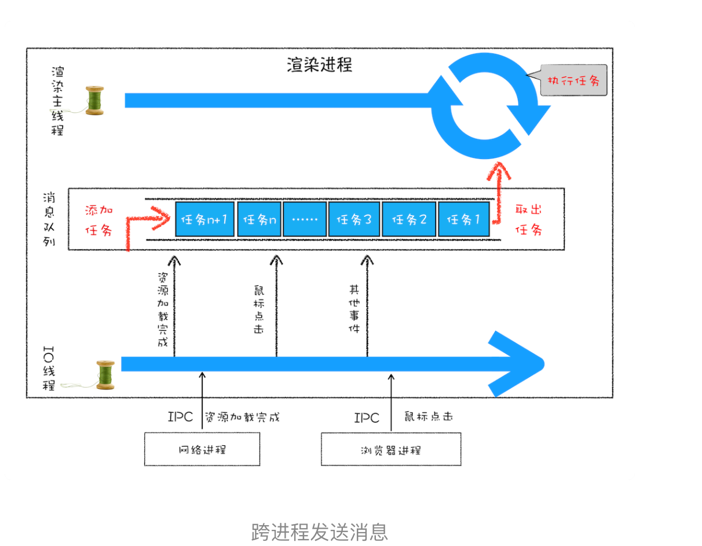
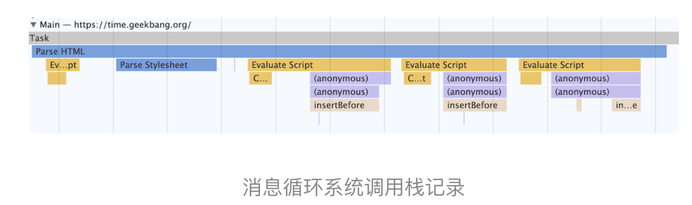
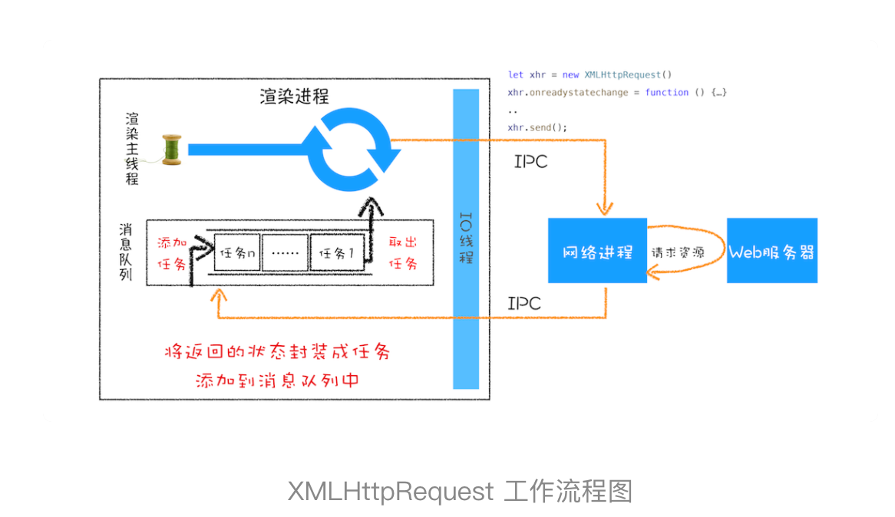
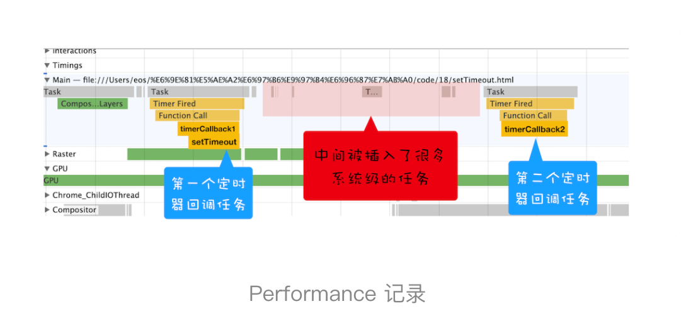
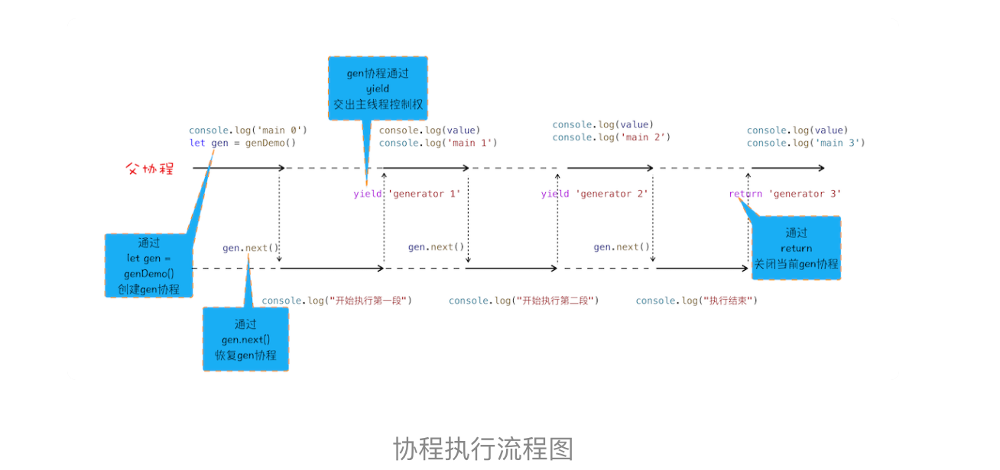
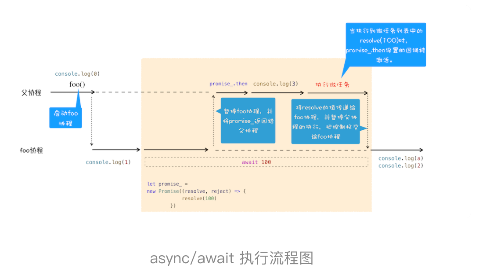

# 浏览器中的页面循环系统

## 消息队列和时间循环：页面是如何活起来的

目前使用最广的消息架构都是基于消息队列设计的。

- 第一版线程模型：假如有一些确定好的任务，使用单线程按顺序处理就好
- 第二版：线程执行过程中需要接受新的任务，-- 引入**循环语句和事件系统**
- 第三版：要接收其他线程发送过来的任务，-- 引入**任务队列**
- 第四版：如果其他进程发送任务给页面主进程 -- 先通过**IPC**把任务发送给渲染**IO线程**，IO线程再把任务发送主线程
- 第五版: 消息队列机制并不是太灵活（有些任务优先级比较高怎么处理），为了适应效率和实时性，引入了**微任务**。



**消息队列**是一种数据结构，可以存放要执行的任务。它符合队列“先进先出”的特点，也就是说要添加任务的话，添加到队列的尾部；要取出任务的话，从队列头部去取。

**渲染进程专门有一个 IO 线程用来接收其他进程传进来的消息**，接收到消息之后，会将这些消息组装成任务。IO 线程中产生的新任务添加进消息队列尾部，渲染主线程会循环地从消息队列头部中读取任务，执行任务。

### 消息队列中的任务类型

输入事件（鼠标滚动、点击、移动）、微任务、文件读写、WebSocket、JavaScript 定时器

包含了很多与页面相关的事件，如 JavaScript 执行、解析 DOM、样式计算、布局计算、CSS 动画。

这些任务都是在主线程中执行的，所以在编写 Web 应用时，你还需要衡量这些事件所占用的时长，并想办法解决单个任务占用主线程过久的问题。

### 页面使用单线程的缺点

消息队列先进先出的特性，只有当前一个任务执行完才会执行下一个任务。

- **如何处理高优先级的任务 --- 引入微任务**

如果 DOM 发生变化我们要做一些逻辑，如果采用同步通知的方式，会影响当前任务的执行效率；如果采用异步的消息事件，添加到消息队列的尾部，又会影响到监控的实时性。

把消息队列中的任务称为**宏任务**，每个宏任务中都包含了一个**微任务队列**

在执行宏任务的过程中，如果 DOM 有变化，那么就会将该变化添加到微任务列表中，这样就不会影响到宏任务的继续执行，因此也就解决了**执行效率的问题**。

等宏任务中的主要功能都直接完成之后，这时候，渲染引擎并不着急去执行下一个宏任务，而是执行当前宏任务中的微任务，因为 DOM 变化的事件都保存在这些微任务队列中，这样也就解决了**实时性问题**。

- **如何解决单个任务执行时长过久的问题 -- 通过回调功能来规避这种问题**


## WebAPI：setTimeout是怎么实现的？

在 Chrome 中除了正常使用的消息队列之外，还有另外一个**延迟消息队列**，这个队列中维护了需要延迟执行的任务列表，包括了定时器和 Chromium 内部一些需要延迟执行的任务。所以当通过 JavaScript 创建一个定时器时，渲染进程会将该定时器的回调任务添加到延迟队列中。


当通过 JavaScript 调用 setTimeout 设置回调函数的时候，渲染进程将会**创建一个回调任务**，包含了回调函数 showName、当前发起时间、延迟执行时间，创建好回调任务之后，再将该任务添加到**延迟执行队列**中

#### 消息循环系统是怎么触发延迟队列的？

**处理完消息队列中的一个任务之后**，就开始执行 ProcessDelayTask 函数。ProcessDelayTask 函数会根据发起时间和延迟时间计算出到期的任务，然后依次执行这些到期的任务。等到期的任务执行完成之后，再继续下一个循环过程。通过这样的方式，一个完整的定时器就实现了。

##### 注意事项

1. 如果当前任务执行时间过久，会影响定时器任务的执行
2.  如果 setTimeout 存在嵌套调用，那么系统会设置最短时间间隔为 4 毫秒
3. 未激活的页面，setTimeout 执行最小间隔是 1000 毫秒
4. 延时执行时间有最大值（2147483647 毫秒 24.8 天）就相当于0
5. 使用 setTimeout 设置的回调函数中的 this 指向window或者undefined

## WebAPI：XMLHttpRequest是怎么实现的？
#### 循环系统调用栈记录
当循环系统在执行一个任务的时候，都要为这个任务维护一个系统调用栈。


记录了一个 Parse HTML 的任务执行过程，其中黄色的条目表示执行 JavaScript 的过程，其他颜色的条目表示浏览器内部系统的执行过程。

Parse HTML 任务在执行过程中会遇到一系列的子过程，比如在解析页面的过程中遇到了 JavaScript 脚本，那么就暂停解析过程去执行该脚本，等执行完成之后，再恢复解析过程。然后又遇到了样式表，这时候又开始解析样式表……直到整个任务执行完成。需要说明的是，整个 Parse HTML 是一个完整的任务，在执行过程中的脚本解析、样式表解析都是该任务的子过程，其下拉的长条就是执行过程中调用栈的信息

#### 工作流程图


XMLHttpRequest 发起请求，是由浏览器的其他进程或者线程去执行，然后再将执行结果利用 IPC 的方式通知渲染进程，之后渲染进程再将对应的消息添加到消息队列中。 大部分WebAPI 的工作逻辑都是类似的。

## 宏任务和微任务
页面中的大部分任务都是在主线程上执行：（**宏任务**）
-  渲染事件（如解析 DOM、计算布局、绘制）
-  用户交互事件（如鼠标点击、滚动页面、放大缩小等）；
-  JavaScript 脚本执行事件；
-  网络请求完成、文件读写完成事件。

宏任务的时间粒度比较大，执行的时间间隔是不能精确控制的，对一些高实时性的需求就不太符合。

```
function timerCallback2(){         
    console.log(2)        
}        
function timerCallback(){            
   console.log(1)            
setTimeout(timerCallback2,0)        
    }        
setTimeout(timerCallback,0)
```

我的目的是想通过 setTimeout 来设置两个回调任务，并让它们按照前后顺序来执行,但是真实的情况是，中间会被插入很多系统级的任务。

**微任务：MutationObserver、Promise**

执行时机：执行时机是在主函数执行结束之后、当前宏任务结束之前。

#### 微任务产生的时机

- 使用 MutationObserver 监控某个 DOM 节点，再用JS更改DOM节点
- Promise，当调用 Promise.resolve() 或者 Promise.reject() 的时候

#### 执行微任务队列的时机

通常情况下，在当前宏任务中的 JavaScript 快执行完成时，也就在 JavaScript 引擎准备退出全局执行上下文并清空调用栈的时候，JavaScript 引擎会检查全局执行上下文中的微任务队列，然后按照顺序执行队列中的微任务。WHATWG 把执行微任务的时间点称为**检查点**。

也就是说在执行微任务过程中产生的新的微任务并不会推迟到下个宏任务中执行，而是在当前的宏任务中继续执行。

#### 结论

- 微任务和宏任务是绑定的，每个宏任务在执行时，会创建自己的微任务队列。
- 微任务的执行时长会影响到当前宏任务的时长
- 在一个宏任务中，分别创建一个用于回调的宏任务和微任务，无论什么情况下，微任务都早于宏任务执行


## 使用Promise，告别回调函数


Promise 主要通过下面两步解决嵌套回调问题的

- Promise 实现了回调函数的延时绑定
- 需要将回调函数 onResolve 的返回值穿透到最外层

## async/await同步的方式写代码

 > Generator 的底层实现机制——协程（Coroutine）

 生成器函数是一个带星号函数，而且是可以暂停执行和恢复执行的。

1. 在生成器函数内部执行一段代码，如果遇到 yield 关键字，那么 JavaScript 引擎将返回关键字后面的内容给外部，并暂停该函数的执行。
2. 外部函数可以通过 next 方法恢复函数的执行


#### 协程

 是一种比线程更加轻量级的存在。你可以把协程看成是跑在线程上的任务，一个线程上可以存在多个协程，但是在线程上同时只能执行一个协程。

 **协程执行流程图**

 ```
 
function* genDemo() {
    console.log("开始执行第一段")
    yield 'generator 2'

    console.log("开始执行第二段")
    yield 'generator 2'

    console.log("开始执行第三段")
    yield 'generator 2'

    console.log("执行结束")
    return 'generator 2'
}

console.log('main 0')
let gen = genDemo()
console.log(gen.next().value)
console.log('main 1')
console.log(gen.next().value)
console.log('main 2')
console.log(gen.next().value)
console.log('main 3')
console.log(gen.next().value)
console.log('main 4')
 ```
 


1. 通过调用生成器函数 genDemo 来创建一个协程 gen，创建之后，gen 协程并没有立即执行。
2. 要让 gen 协程执行，需要通过调用 gen.next。
3. 当协程正在执行的时候，可以通过 yield 关键字来暂停 gen 协程的执行，并返回主要信息给父协程。
4. 如果协程在执行期间，遇到了 return 关键字，那么 JavaScript 引擎会结束当前协程，并将 return 后面的内容返回给父协程。

#### async/await 

async/await 技术背后的秘密就是 **Promise** 和**生成器**应用，往低层说就是**微任务**和**协程**应用

async 是一个通过异步执行并隐式返回 Promise 作为结果的函数。

```

async function foo() {
    console.log(1)
    let a = await 100
    console.log(a)
    console.log(2)
}
console.log(0)
foo()
console.log(3)
```

 

 1. 执行console.log(0)这个语句，打印出来 0
 2. 由于 foo 函数是被 async 标记过的，所以当进入该函数的时候，JavaScript 引擎会保存当前的调用栈等信息，然后执行 foo 函数中的console.log(1)语句，并打印出 1。
 3. 当执行到await 100时，会默认创建一个 Promise 对象

	```
	 
	let promise_ = new Promise((resolve,reject){
	  resolve(100)
	})
	
	```

 4.  executor 函数中调用了 resolve 函数，JavaScript 引擎会将该任务提交给微任务队列

 5. JavaScript 引擎会暂停当前协程的执行，将主线程的控制权转交给父协程执行，同时会将 promise_ 对象返回给父协程
 6. 主线程的控制权已经交给父协程了，这时候父协程要做的一件事是调用 promise_.then 来监控 promise 状态的改变
 7. 接下来继续执行父协程的流程，在结束之前，会进入微任务的检查点，然后执行微任务队列，微任务队列中有resolve(100)的任务等待执行，执行到这里的时候，会触发 promise_.then 中的回调函数

	```
	 
	promise_.then((value)=>{
	   //回调函数被激活后
	  //将主线程控制权交给foo协程，并将vaule值传给协程
	})
	```
该回调函数被激活以后，会将主线程的控制权交给 foo 函数的协程，并同时将 value 值传给该协程。

8. foo 协程激活之后，会把刚才的 value 值赋给了变量 a，然后 foo 协程继续执行后续语句，执行完成之后，将控制权归还给父协程


```

async function foo() {
    console.log('foo')
}
async function bar() {
    console.log('bar start')
    await foo()
    console.log('bar end')
}
console.log('script start')
setTimeout(function () {
    console.log('setTimeout')
}, 0)
bar();
new Promise(function (resolve) {
    console.log('promise executor')
    resolve();
}).then(function () {
    console.log('promise then')
})
console.log('script end')
```


1. 首先在主协程中初始化异步函数foo和bar，碰到console.log打印script start；
2. 解析到setTimeout，初始化一个Timer，创建一个新的task
3. 执行bar函数，将控制权交给协程，输出bar start，碰到await，执行foo，输出foo，创建一个 Promise返回给主协程
4. 将返回的promise添加到微任务队列，向下执行 new Promise，输出 promise executor，返回resolve 添加到微任务队列
5. 输出script end
6. 当前task结束之前检查微任务队列，执行第一个微任务，将控制器交给协程输出bar end
7. 执行第二个微任务 输出 promise then
8. 当前任务执行完毕进入下一个任务，输出setTimeout


