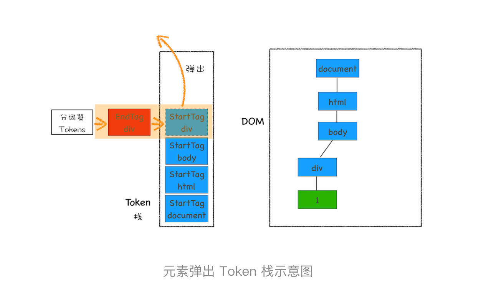
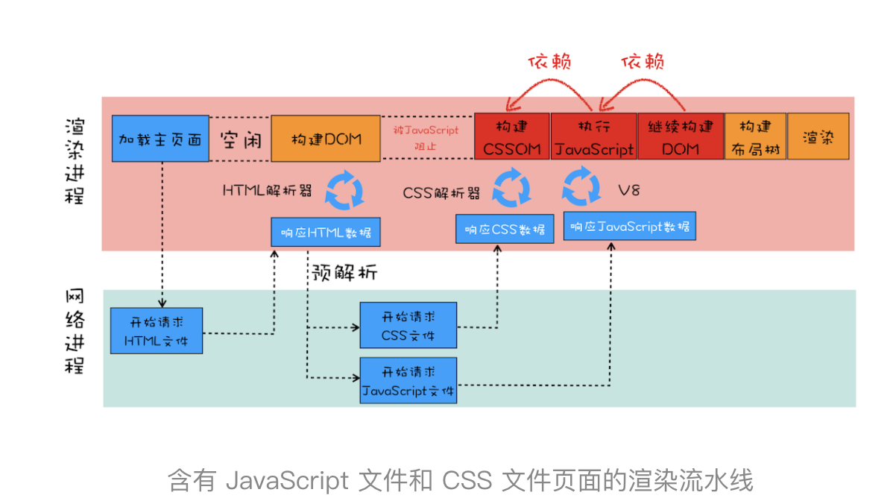
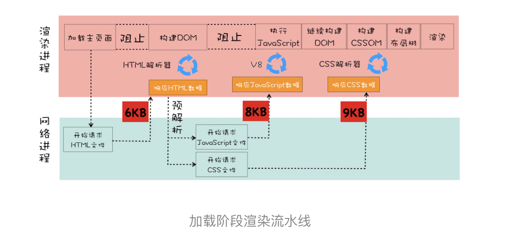
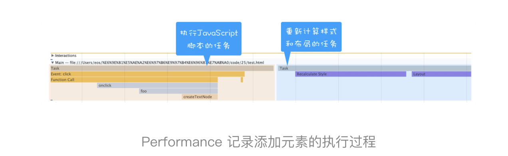
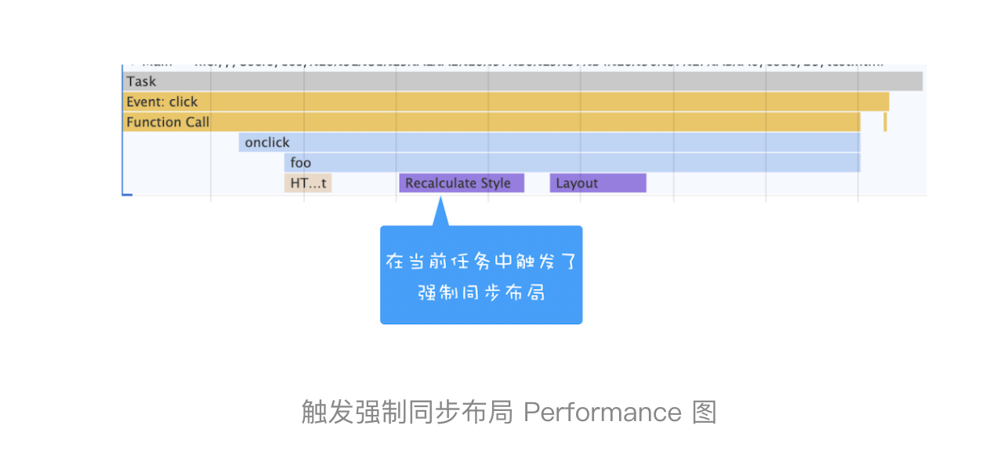
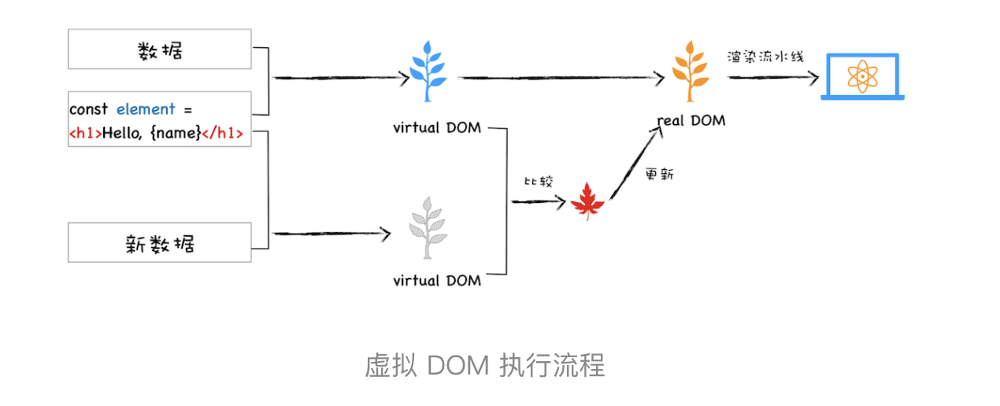

#   浏览器中的页面


## Chrome开发者工具：利用网络面板做性能分析


## DOM树：JavaScript是如何影响DOM树构建的？

#### DOM 树如何生成

渲染引擎内部，有一个叫 **HTML 解析器（HTMLParser** 的模块，它的职责就是负责将**HTML 字节流** 转换为 **DOM 结构**。

1. 通过分词器将字节流转换为 Token （Tag Token 和文本 Token）
2-3.同时进行 Token 解析为 DOM 节点，并将 DOM 节点添加到 DOM 树中。



HTML 解析器维护了一个 Token 栈结构，该 Token 栈主要用来计算节点之间的父子关系。
1. 遇到 StartTag Token 压栈，将该节点加入到 DOM 树中
2.  文字token不压栈，会生成一个文本节点，然后将该节点加入到 DOM 树中，文本 Token 是不需要压入到栈中，它的父节点就是当前栈顶 Token 所对应的 DOM 节点。
3. 是 EndTag 标签，HTML 解析器会查看 Token 栈顶的元素是否是 StarTag div，如果是，就将 StartTag  div 从栈中弹出，表示该 div 元素解析完成

#### HTML 解析器是怎么工作的。

并不是等整个文档加载完成之后再解析的，而是网络进程加载了多少数据，HTML 解析器便解析多少数据。


在执行 JavaScript 之前，需要先解析 JavaScript 语句之上所有的 CSS 样式。所以如果代码里引用了外部的 CSS 文件，那么在执行 JavaScript 之前，还需要等待外部的 CSS 文件下载完成，并解析生成 CSSOM 对象之后，才能执行 JavaScript 脚本。

而 JavaScript 引擎在解析 JavaScript 之前，是不知道 JavaScript 是否操纵了 CSSOM 的，所以渲染引擎在遇到 JavaScript 脚本时，不管该脚本是否操纵了 CSSOM，都会执行 CSS 文件下载，解析操作，再执行 JavaScript 脚本。


所以说 JavaScript 脚本是依赖样式表的。

**JavaScript 会阻塞 DOM 生成，而样式文件又会阻塞 JavaScript 的执行**，所以在实际的工程中需要重点关注 JavaScript 文件和样式表文件，使用不当会影响到页面性能的。


**async**：脚本并行加载，加载完成之后立即执行，执行时机不确定，仍有可能阻塞HTML解析，执行时机在load事件派发之前

**defer**：脚本并行加载，等待HTML解析完成之后，按照加载顺序执行脚本，执行时机在DOMContentLoaded事件派发之前

## 23 | 渲染流水线：CSS如何影响首次加载时的白屏时间？



白屏时间过久，就会影响到用户体验。为了缩短白屏时间，我们来挨个分析这个阶段的主要任务，包括了解析 HTML、下载 CSS、下载 JavaScript、生成 CSSOM、执行 JavaScript、生成布局树、绘制页面一系列操作。通常情况下的瓶颈主要体现在下载 CSS 文件、下载 JavaScript 文件和执行 JavaScript。

## 分层和合成机制：为什么CSS动画比JavaScript高效？


## 如何系统优化页面

页面的生命周期分为三个阶段 加载阶段 交互阶段 关闭阶段

#### 概念
> **关键资源**：阻塞首次渲染的资源成为**关键资源** html css js

> **RTT**: 表示从发送端发送数据开始，到发送端收到来自接收端的确认，总共经历的时延,1 个 HTTP 的数据包在 14KB 左右，所以 1 个 0.1M 的页面就需要拆分成 8 个包来传输了，也就是说需要 8 个 RTT.

#### 加载阶段

- **减少关键资源的个数**
	1. 内联
	2. 如果 JavaScript 代码没有 DOM 或者 CSSOM 的操作，则可以改成 async 或者 defer 属性（此时为非关键资源）
	3. CSS，如果不是在构建页面之前加载的，则可以添加媒体取消阻止显现的标志(此时为非关键资源)
	
		```
		<link rel="stylesheet" href="css.css" media="none" οnlοad="if(media!='all')media='all'">
		触发异步样式下载的诀窍是使用一个 <link> 元素，并 为media 属性设置一个不可用的值 (我用的是 media=”none”, 不过其它的任何值也是可以的)。当一个媒体查询的结果值计算出来是 false 的时候，浏览器仍然会下载样式表，但是不会在渲染页面之前等待样式表的资源可用.
		样式表一下载好，media 属性就必须被设置一个可用的值，以便样式规则能被应用到 html 文档中onload 事件就可以用来将 media 属性切换到all：
		```
- **减少关键资源的大小**
	
	1. 压缩  js tree shake css tree shake
- **减少关键资源的RTT个数**
	1. 通过1，2配合实现
	2.  CDN 来减少每次 RTT 时长

加载阶段渲染流水线



首先是请求 HTML 资源，大小是 6KB，小于 14KB，所以 1 个 RTT 就可以解决了。至于 JavaScript 和 CSS 文件，这里需要注意一点，由于渲染引擎有一个预解析的线程，在接收到 HTML 数据之后，预解析线程会快速扫描 HTML 数据中的关键资源，一旦扫描到了，会立马发起请求，你可以认为 JavaScript 和 CSS 是同时发起请求的，所以它们的请求是重叠的，那么计算它们的 RTT 时，只需要计算体积最大的那个数据就可以了。

#### 交互阶段

谈交互阶段的优化，其实就是在谈**渲染进程渲染帧的速度**，因为在交互阶段，帧的渲染速度决定了交互的流畅度。

##### 如何让单个帧生成的速度变快呢

1. 减少 JavaScript 脚本执行时间
	- 将一次执行的函数分解为多个任务
	- web workers
2. 避免强制同步布局(JavaScript 强制将计算样式和布局操作提前到当前的任务中)
	正常情况下：执行 JavaScript 添加元素是在一个任务中执行的，重新计算样式布局是在另外一个任务中执行
	
	将新的元素添加到 DOM 之后，我们又调用了main_div.offsetHeight来获取新 main_div 的高度信息。如果要获取到 main_div 的高度，就需要重新布局，所以这里在获取到 main_div 的高度之前，JavaScript 还需要强制让渲染引擎默认执行一次布局操作。我们把这个操作称为强制同步布局
	
3. 避免布局抖动(在一次 JavaScript 执行过程中，多次执行强制布局和抖动操作)
4. 合理利用 CSS 合成动画(如果能提前知道对某个元素执行动画操作，那就最好将其标记为 will-change，这是告诉渲染引擎需要将该元素单独生成一个图层)
5. 避免频繁的垃圾回收

#### 关闭阶段 

-


## 虚拟DOM和实际的DOM有何不同


#### DOM缺点

	- 假如我们操作dom，会触发 样式计算，布局，绘制，栅格化，合成等任务，除了重排还可能触发重绘 合成等操纵，牵一发而动全身
	- dom操作不当还会触发强制同步布局和布局抖动问题大大影响渲染效率
	- 浏览器实现js的和实现dom是在两个位置实现的，操作dom 本身就会收过路费
	- so 我们需要一种js减少DOM的操作

#### 虚拟dom如何解决这些缺点

**虚拟DOM**反映了真实的 DOM 树的结构，可以看成是DOM的一个buffer。 更大的一个好处是完成**跨端**。

##### 虚拟dom如何运行

**创建阶段**：根据JSX和数据创造出虚拟DOM，由虚拟DOM创建真实DOM，DOM数生成后再触发渲染流水线

**更新阶段**：数据变化后，根据新的数据香皂 一个新的虚拟DOM，比较两个树，找出变化的地方，并把变化的地方一次更新到真实的DOM上，最后渲染引擎更新渲染流水线。



##### React Fiber 更新机制

最开始的时候，比较两个虚拟 DOM 的过程是在一个递归函数里执行的，其核心算法是 reconciliation。通常情况下，这个比较过程执行得很快，不过当虚拟 DOM 比较复杂的时候，执行比较函数就有可能占据主线程比较久的时间，这样就会导致其他任务的等待，造成页面卡顿。为了解决这个问题，React 团队重写了 reconciliation 算法，新的算法称为 Fiber reconciler，之前老的算法称为 Stack reconciler。

**协程**的另外一个称呼就是 **Fiber**：执行算法的过程中出让主线程，这样就解决了 Stack reconciler 函数占用时间过久的问题。

#### 站在双缓存和MVC的角度来看虚拟DOM（对前端框架有个更底层的认识）

**双缓存：**屏幕从前缓冲区读取数据然后显示。一幅完整的画面，可能需要计算多次才能完成，如果每次计算完一部分图像，就将其写入缓冲区看到的页面效果可能是一部分一部分地显示出来，因此在刷新页面的过程中，会让用户感受到界面的闪烁。

双缓存，可以让你先将计算的中间结果存放在另一个缓冲区中，等全部的计算结束，该缓冲区已经存储了完整的图形之后，再将该缓冲区的图形数据一次性复制到显示缓冲区，这样就使得整个图像的输出非常稳定。

双缓存是一种经典的思路，应用在很多场合，能解决页面无效刷新和闪屏的问题，虚拟 DOM 就是双缓存思想的一种体现。

	虚拟 DOM 看成是 DOM 的一个 buffer。

**MVC:**核心思想就是将数据和视图分离.虚拟 DOM 看成是 MVC 的视图部分，其控制器和模型都是由 Redux 提供的.


## 渐进式网页应用（PWA）：它究竟解决了Web应用的哪些问题

web最大的优势就是自由开放，很容易对同一件事情达成共识，达成共识以后就可以一套代码运行到多端，跨平台。

**PWA**其实是一种理念，渐进式的增强web的优势，通过技术手段渐进式的缩短与本地app和小程序之间的差距。

通过引入 **Service Worker** 来试着解决**离线存储和消息推送**的问题，通过引入 **manifest.json** 来解决**一级入口**的问题


**Service Worker** 的主要功能就是拦截请求和缓存资源

## WebComponent：像搭积木一样构建Web应用

**组件化：**对内高内聚，对外低耦合。

 CSS 和 DOM的全局属性 是阻碍前端组件化的两个因素。

 **webComponent**是一套组合技术，设计到了 Custom elements（自定义元素）、Shadow DOM（影子 DOM）和HTML templates（HTML 模板）


#### shadow dom作用

- 影子DOM中的元素 对于整个网页不可见，遍历不到
- 影子DOM中的css不会影响整个网页的CSSOM，影子dom中的css只对内部的元素起作用。

#### 浏览器如何实现shadow dom

- 浏览器为了实现影子 DOM 的特性，在代码内部做了大量的条件判断，比如当通过 DOM 接口去查找元素时，渲染引擎会去判断 geek-bang 属性下面的 shadow-root 元素是否是影子 DOM，如果是影子 DOM，那么就直接跳过 shadow-root 元素的查询操作。所以这样通过 DOM API 就无法直接查询到影子 DOM 的内部元素了
- 另外，当生成布局树的时候，渲染引擎也会判断 geek-bang 属性下面的 shadow-root 元素是否是影子 DOM，如果是，那么在影子 DOM 内部元素的节点选择 CSS 样式的时候，会直接使用影子 DOM 内部的 CSS 属性。所以这样最终渲染出来的效果就是影子 DOM 内部定义的样式。