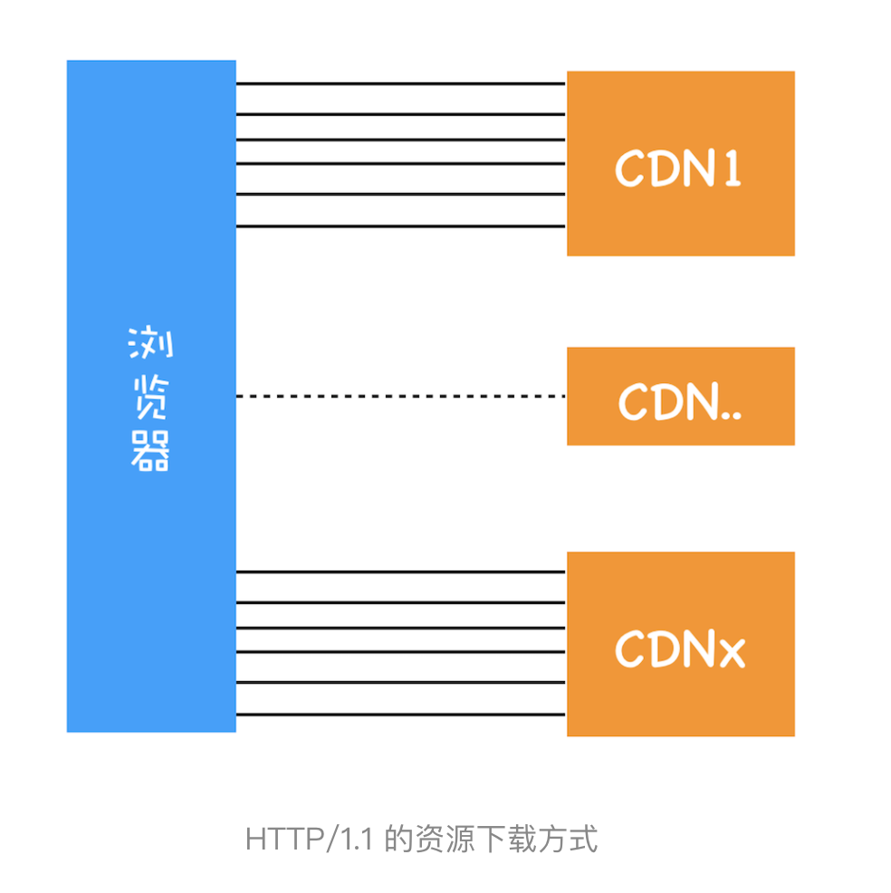
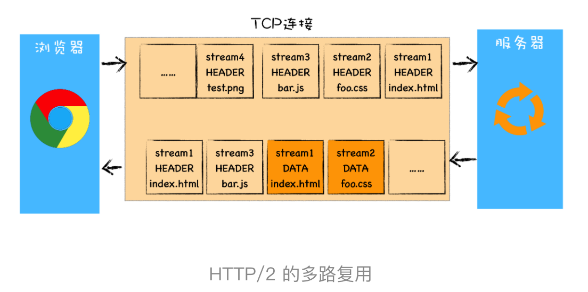
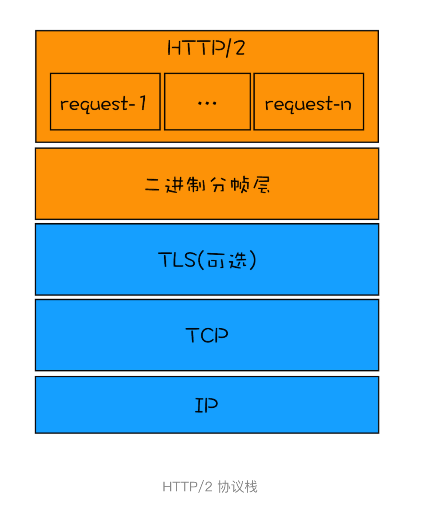
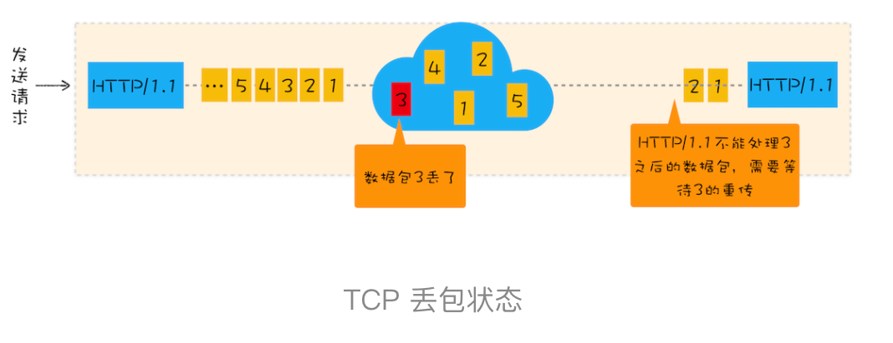
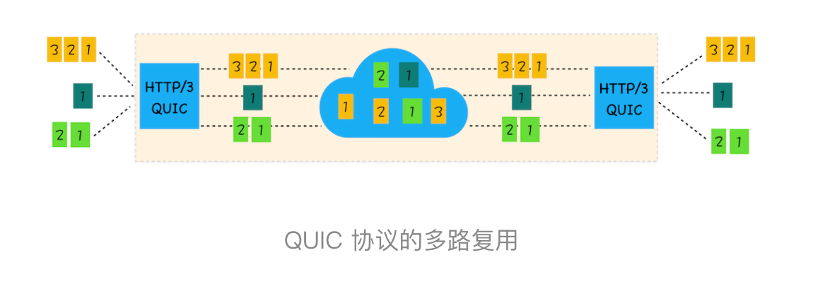
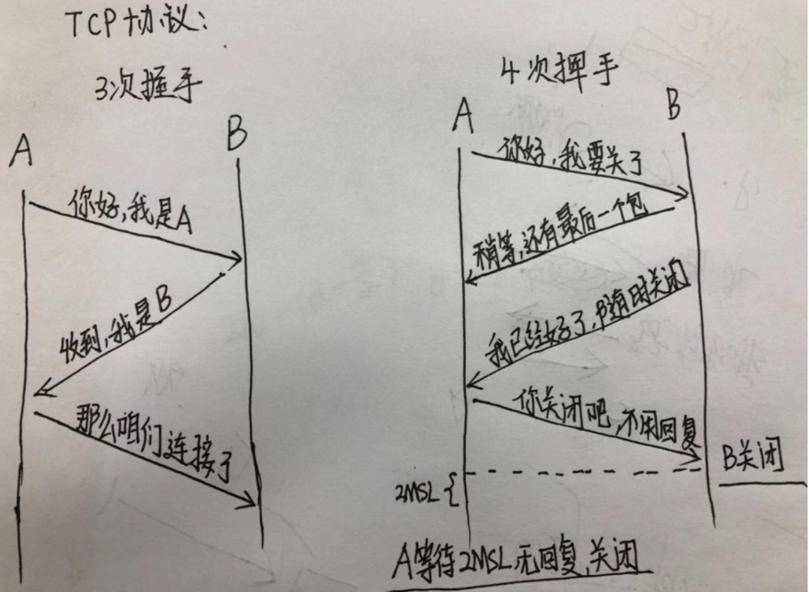

# 网络

>   从浏览器发展的视角来和你聊聊 HTTP 演进, 即将完成使命的 HTTP/1、正在向我们走来的 HTTP/2，以及未来的 HTTP/3

## 即将完成使命的 http1: http性能优化,

### 超文本传输协议http0.9
实现也很简单，采用了基于请求响应的模式，从客户端发出请求，服务器返回数据。
- 只有一个请求行，并没有 HTTP 请求头和请求体
- 服务器也没有返回头信息
- 返回的文件内容是以 ASCII 字符流来传输的

### 被浏览器推动的 HTTP/1.0
分析下新兴网络都带来了哪些新需求:不单是 HTML 文件了，还包括了 JavaScript、CSS、图片、音频、视频等不同类型的文件。因此支持**多种类型的文件下载**是 HTTP/1.0 的一个核心诉求，而且文件格式不仅仅局限于 ASCII 编码，还有很多其他类型编码的文件。

	HTTP/1.0 引入了请求头和响应头，它们都是以为 Key-Value 形式保存的，在 HTTP 发送请求时，会带上请求头信息，服务器返回数据时，会先返回响应头信息


- 文件类型 压缩方式 语言 编码

```
accept: text/html
accept-encoding: gzip, deflate, br
accept-Charset: ISO-8859-1,utf-8
accept-language: zh-CN,zh
```
- 为了处理错误引入**状态码**
- 为了减轻服务器压力引入**Cache机制**
- 统计客户端基础信息引入**用户代理字段**

### 缝缝补补的http1.1

- 改进持久链接，在一个 TCP 连接上可以传输多个 HTTP 请求，只要浏览器或者服务器没有明确断开连接，那么该 TCP 连接会一直保持。

		目前浏览器中对于同一个域名，默认允许同时建立 6 个 TCP 持久连接。
- 不成熟的 HTTP 管线化，FireFox、Chrome 都做过管线化的试验，最后都放弃了
- 对动态生成的内容提供了完美支持
- 提供虚拟主机的支持 **host**

		HTTP/1.0 中，每个域名绑定了一个唯一的 IP 地址，Host 字段，用来表示当前的域名地址，这样服务器就可以根据不同的 **Host** 值做不同的处理
	
- 客户端  Cookie、安全机制

## 正在向我们走来的 HTTP/2：如何提升网络速度？

HTTP/1.1 已经做了大量的优化，但是依然存在很多性能瓶颈，依然不能满足我们日益变化的新需求

### 从需求层面http1.1有哪些问题，http2.0是如何解决的。

#### http1.1做了大量的优化
- 增加了持久链接
- 浏览器为每个域名增加了6个持久链接
- 使用cdn实现域名分配机制



如果使用单个 TCP 的持久连接，下载 100 个资源所花费的时间为 100 * n * RTT。
若通过上面的技术，就可以把整个时间缩短为 100 * n * RTT/(6 * CDN 个数)。

#### http1.1的主要问题

1. 随着网速的提升**对带宽的利用率不理想**很难将带宽用满
	
	**带宽**：每秒最大能发送或者接收的字节数。我们把每秒能发送的最大字节数称为上行带宽，每秒能够接收的最大字节数称为下行带宽
	**队头阻塞**: HTTP/1.1 中使用持久连接时虽然能公用一个 TCP 管道，但是在一个管道中同一时刻只能处理一个请求，在当前的请求没有结束之前，其他的请求只能处于阻塞状态。这意味着我们不能随意在一个管道中发送请求和接收内容。

	**原因**
	
	1. TCP 的慢启动
	
		一旦一个 TCP 连接建立之后，就进入了发送数据状态，刚开始 TCP 协议会采用一个非常慢的速度去发送数据，然后慢慢加快发送数据的速度，直到发送数据的速度达到一个理想状态，我们把这个过程称为慢启动。慢启动是 TCP 为了减少网络拥塞的一种策略。
		
	2. 同时开启了多条 TCP 连接，那么这些连接会竞争固定的带宽
	
		比如一个网页有3个cdn，同事就会有3*6个tcp连接。这些连接会同时竞争固定的带宽，有些TCP 连接下载的是一些关键资源，如 CSS 文件、JavaScript 文件等，而有的 TCP 连接下载的是图片、视频等普通的资源文件，但是 **多条 TCP 连接之间又不能协商让哪些关键资源优先下载**，这样就有可能影响那些关键资源的下载速度了。
		
	3. HTTP/1.1 队头阻塞的问题
	
		有的请求被阻塞了 5 秒，那么后续排队的请求都要延迟等待 5 秒，在这个等待的过程中，带宽、CPU 都被白白浪费了。
2. 假如服务器最大并发5000，那么 对于客户端就是 5000/6
#### HTTP/2 的多路复用 

 HTTP/1.1 所存在的一些主要问题：慢启动和 TCP 连接之间相互竞争带宽是由于 TCP 本身的机制导致的，而队头阻塞是由于 HTTP/1.1 的机制导致的


TCP 有问题，但是我们依然没有换掉 TCP 的能力，所以我们就要想办法去规避 TCP 的慢启动和 TCP 连接之间的竞争问题, **HTTP/2 的思路**就是**一个域名只使用一个 TCP 长连接来传输数据，这样整个页面资源的下载过程只需要一次慢启动，同时也避免了多个 TCP 连接竞争带宽所带来的问题。**

HTTP/2 需要 **实现资源的并行请求** 任何时候都可以将请求发送给服务器，而并不需要等待其他请求的完成，然后服务器也可以随时返回处理好的请求资源给浏览器。

**最核心、最重要且最具颠覆性的多路复用机制**


HTTP/2 使用了多路复用技术，可以将请求分成一帧一帧的数据去传输，这样带来了一个额外的好处，就是当收到一个优先级高的请求时，比如接收到 JavaScript 或者 CSS 关键资源的请求，服务器可以暂停之前的请求来优先处理关键资源的请求

#### 多路复用的实现


HTTP/2 添加了一个**二进制分帧层**，那我们就结合图来分析下 HTTP/2 的请求和接收过程。



- 首先，浏览器准备好请求数据，包括了请求行、请求头等信息，如果是 POST 方法，那么还要有请求体。
- 这些数据经过二进制分帧层处理之后，会被转换为一个个带有请求 ID 编号的帧，通过协议栈将这些帧发送给服务器。
- 服务器接收到所有帧之后，会将所有相同 ID 的帧合并为一条完整的请求信息。
- 然后服务器处理该条请求，并将处理的响应行、响应头和响应体分别发送至二进制分帧层。
- 同样，二进制分帧层会将这些响应数据转换为一个个带有请求 ID 编号的帧，经过协议栈发送给浏览器。
- 浏览器接收到响应帧之后，会根据 ID 编号将帧的数据提交给对应的请求。 

### HTTP2其他特性

多路复用是 HTTP/2 的最核心功能，它能实现资源的并行传输。多路复用技术是建立在二进制分帧层的基础之上。其实基于二进制分帧层，HTTP/2 还附带实现了很多其他功能。

1. 可以设置请求的优先级
2. 服务器推送

		当用户请求一个 HTML 页面之后，服务器知道该 HTML 页面会引用几个重要的 JavaScript 文件和 CSS 文件，那么在接收到 HTML 请求之后，附带将要使用的 CSS 文件和 JavaScript 文件一并发送给浏览器
	
3. 头部压缩

## 未来的 HTTP/3：甩掉TCP、TLS 的包袱，构建高效网络

### http2还有哪些缺陷 

HTTP/2 的一个核心特性是使用了多路复用技术，因此它可以通过一个 TCP 连接来发送多个 URL 请求。多路复用技术能充分利用带宽，最大限度规避了 TCP 的慢启动所带来的问题，同时还实现了头部压缩、服务器推送等功能，使得页面资源的传输速度得到了大幅提升。但是还是有一些缺陷

#### TCP 的队头阻塞

 HTTP/2 只解决了应用层面的队头阻塞问题。

 TCP 最初就是为了单连接而设计的。你可以把 TCP 连接看成是两台计算机之间的一个虚拟管道，计算机的一端将要传输的数据按照顺序放入管道，最终数据会以相同的顺序出现在管道的另外一头

 在 TCP 传输过程中，由于单个数据包的丢失而造成的阻塞称为 TCP 上的队头阻塞。

 如果在数据传输的过程中，有一个数据因为网络故障或者其他原因而丢包了，那么整个 TCP 的连接就会处于暂停状态，需要等待丢失的数据包被重新传输过来。你可以把 TCP 连接看成是一个按照顺序传输数据的管道，管道中的任意一个数据丢失了，那之后的数据都需要等待该数据的重新传输

 

#### TCP 建立连接的延时

除了 TCP 队头阻塞之外，TCP 的握手过程也是影响传输效率的一个重要因素。

**RTT**浏览器发送一个数据包到服务器，再从服务器返回数据包到浏览器的整个往返时间称为 RTT（如下图）。RTT 是反映网络性能的一个重要指标。

#### tcp协议僵化

- 中间设备的僵化
- 系统的更新都滞后于软件的更新，因此要想自由地更新内核中的 TCP 协议也是非常困难的


### http 3

HTTP/2 存在一些比较严重的与 TCP 协议相关的缺陷，但由于 TCP 协议僵化，我们几乎不可能通过修改 TCP 协议自身来解决这些问题，那么解决问题的思路是绕过 TCP 协议，发明一个 TCP 和 UDP 之外的新的传输协议。但是这也面临着和修改 TCP 一样的挑战，因为中间设备的僵化，这些设备只认 TCP 和 UDP，如果采用了新的协议，新协议在这些设备同样不被很好地支持。

##### QUIC 协议

折中方案：**基于 UDP 实现了类似于 TCP 的多路数据流、传输可靠性等功能，我们把这套功能称为 QUIC 协议**

- **实现了类似 TCP 的流量控制、传输可靠性的功能**
- **集成了 TLS 加密功能**
- **实现了 HTTP/2 中的多路复用功能**。和 TCP 不同，QUIC 实现了在**同一物理连接上可以有多个独立的逻辑数据流（如下图）**。实现了数据流的单独传输，就解决了 TCP 中队头阻塞的问题。



- **实现了快速握手功能**  QUIC 是基于 UDP 的，所以 QUIC 可以实现使用 0-RTT 或者 1-RTT 来建立连接

#### http3协议的挑战

- 服务器和浏览器端都没有对 HTTP/3 提供比较完整的支持
- 部署 HTTP/3 也存在着非常大的问题。因为系统内核对 UDP 的优化远远没有达到 TCP 的优化程度
- 中间设备僵化的问题。这些设备对 UDP 的优化程度远远低于 TCP，据统计使用 QUIC 协议时，大约有 3%～7% 的丢包率。



- A: 你好我是A
- B: 你好我是B
- A: ok 那么咱们可以连接了
- A: 你好我要关了
- B: 稍等还有一个包，我正在传输这个
- B: 我好了随时可以关
- A: 你关吧，不用回了
- A:等待2MSL 无回应就关闭
- 所谓的2MSL是两倍的MSL（最大段终身）.MSL指一个片段在网络中最大的存活时间，2MSL就是一个发送和一个回复所需的最大时间


