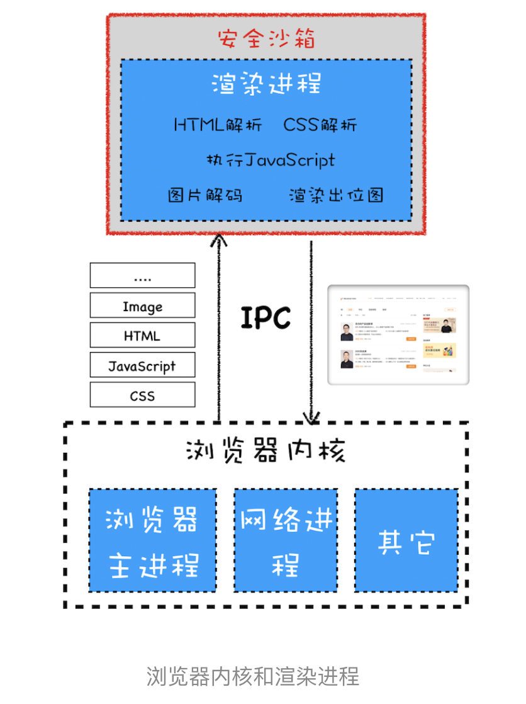

# WEB页面安全

## 同源策略（Same-origin policy）：为什么XMLHttpRequest不能跨域请求资源？

 > 如果两个 URL 的协议、域名和端口都相同，我们就称这两个 URL 同源

### 同源策略主要表现在 DOM、Web 数据和网络这三个层面

- dom层
	- 通过某页面进入页面，假如同源，就可以操作上一个页面的dom
	
	```
		{
		let pdom = opener.document
		pdom.body.style.display = "none"
		}
	```
- 数据层面
	
	- 同源策略限制了不同源的站点读取当前站点的 Cookie、IndexDB、LocalStorage 等数据
- 网络层面

### 安全和便利性的权衡
出让一些安全性来满足灵活性；而出让安全性又带来了很多安全问题，最典型的是 XSS 攻击和 CSRF 攻击，

#### 页面中可以嵌入第三方资源
#### 跨域资源共享和跨文档消息机制
- 跨域资源共享（CORS），使用该机制可以进行跨域访问控制，从而使跨域数据传输得以安全进行
	- Cross Origin Resource Sharing 
	- 简单请求和非简单请求
	- 注意：过滤掉预检请求 OPTIONS
- 跨文档消息机制，可以通过 window.postMessage 的 JavaScript 接口来和不同源的 DOM 进行通信

## 跨站脚本攻击（XSS）：为什么Cookie中有HttpOnly属性？

XSS 全称是 Cross Site Scripting，“跨站脚本”。XSS 攻击是指黑客往 HTML 文件中或者 DOM 中注入恶意脚本，从而在用户浏览页面时利用注入的恶意脚本对用户实施攻击的一种手段。


### 常见的三种 XSS 攻击模式
- 存储型 XSS 攻击
	- 将恶意代码写入到服务器，2015 年喜马拉雅就被曝出了存储型 XSS 漏洞
- 反射型 XSS 攻击
	- 将一段含有恶意代码的请求提交给 Web 服务器，Web 服务器接收到请求时，又将恶意代码反射给了浏览器端
- 基于 DOM 的 XSS 攻击
	- 不牵涉到页面 Web 服务器的  WiFi 路由器劫持的，有通过本地恶意软件来劫持的

### 如何防止XSS
- **服务器对脚本进行过滤和转码**
- **充分利用 CSP**
	- **CSP核心思想** 就是 
	- 限制加载其他域下的资源文件，这样即使黑客插入了一个 JavaScript 文件，这个 JavaScript 文件也是无法被加载的；
	- 禁止向第三方域提交数据，这样用户数据也不会外泄；
	- 禁止执行内联脚本和未授权的脚本；
	- 还提供了上报机制，这样可以帮助我们尽快发现有哪些 XSS 攻击，以便尽快修复问题
- 使用 **HttpOnly** 属性

	- 用 HttpOnly 标记的 Cookie 只能使用在 HTTP 请求过程中，所以无法通过 JavaScript 来读取这段 Cookie


## CSRF攻击(跨站请求伪造)：陌生链接不要随便点

### 什么是CSFR（Cross-site request forgery）

**CSFR**指黑客引诱用户打开黑客的网站，在黑客的网站中，利用用户的登录状态发起的跨站请求。简单来讲，CSRF 攻击就是黑客利用了用户的登录状态，并通过第三方的站点来做一些坏事。

1. 自动发起 Get 请求

		请求接口隐藏在 img 标签内
2. 自动发起POST请求

		通过隐藏的form表单
3. 引诱用户点击链接

		诱惑用户点击黑客站点上的链接，这种方式通常出现在论坛或者恶意邮件上
### csrf的三个必要条件

1. 网站有csrf漏洞
2. 用户登录，并保持登录态
3. 用户打开第三方网站 或论坛

### 如何防范

1. 充分利用好 Cookie 的 **SameSite** 属性

	- Strict 完全禁止第三方 Cookie
	- lax(chrome80已默认改为lax) 从第三方站点的链接打开和从第三方站点提交 Get 方式的表单这两种方式都会携带 Cookie。但如果在第三方站点中使用 Post 方法，或者通过 img、iframe 等标签加载的 URL，这些场景都不会携带 Cookie
	- none 不做限制
2. **验证请求的来源站点**（origin referer）
		
		服务器的策略优先判断Origin，如果请求头中没有包含 Origin 属性，再根据实际情况判断是否使用 Referer 值

3. **csrf-token**

	1. 在浏览器向服务器发起请求时，服务器生成一个 CSRF Token。返回给浏览器
	2. 下次请求带上token，服务端去验证 

## 点击劫持

一种视觉欺骗的攻击手段。攻击者将需要攻击的网站通过 iframe 嵌套的方式嵌入自己的网页中，并将 iframe 设置为透明，在页面中透出一个按钮诱导用户点击

### 防御手段

1. X-FRAME-OPTIONS HTTP 响应头 就是为了防御用 iframe 嵌套的点击劫持攻击

	- DENY，表示页面不允许通过 iframe 的方式展示
	- SAMEORIGIN，表示页面可以在相同域名下通过 iframe 的方式展示
	- ALLOW-FROM，表示页面可以在指定来源的 iframe 中展示

2. js

```
<head>
  <style id="click-jack">
    html {
      display: none !important;
    }
  </style>
</head>
<body>
  <script>
    if (self == top) {
      var style = document.getElementById('click-jack')
      document.body.removeChild(style)
    } else {
      top.location = self.location
    }
  </script>
</body>
```
当通过 iframe 的方式加载页面时，攻击者的网页直接不显示所有内容了


# 浏览器网络安全

浏览器被分为**浏览器内核**和**渲染内核**两部分，浏览器内核包括**浏览器进程，网络进程， GPU 进程**，渲染内核就是**渲染进程**


### 两个模块如何配合

所有的网络资源都是浏览器内核下载的，--> ipc通信提交渲染内核，-->渲染进程进行解析绘制，最后生成一张图，渲染进程不负责把图显示到界面上，-->提交给浏览器内核，浏览器内核模块负责显示这张图片


### 总结

浏览器在多进程的基础之上引入了安全沙箱，有了安全沙箱，就可以将操作系统和渲染进程进行隔离，这样即便渲染进程由于漏洞被攻击，也不会影响到操作系统的

由于渲染进程采用了安全沙箱，所以在渲染进程内部不能与操作系统直接交互，于是就在浏览器内核中实现了持久存储、网络访问和用户交互等一系列与操作系统交互的功能，然后通过 IPC 和渲染进程进行交互

# 浏览器系统安全

### 中间人攻击

我们使用 HTTP 传输的内容很容易被中间人窃取、伪造和篡改，通常我们把这种攻击方式称为**中间人攻击**。具体来讲，在将 HTTP 数据提交给 TCP 层之后，数据会经过用户电脑、WiFi 路由器、运营商和目标服务器，在这中间的每个环节中，数据都有可能被窃取或篡改

**在 HTTP 协议栈中引入安全层**

安全层有两个主要的职责：**对发起 HTTP 请求的数据进行加密操作**和**对接收到 HTTP 的内容进行解密操作**。

#### 从简单到复杂的 HTTPS 协议

**对称加密：**对称加密是指加密和解密都使用的是相同的密钥

**非对称加密：**非对称加密算法有 A、B 两把密钥，如果你用 A 密钥来加密，那么只能使用 B 密钥来解密；反过来，如果你要 B 密钥来加密，那么只能用 A 密钥来解密。

**对称加密**

我们使用对称加密实现了安全层，使用对称加密

**非对称加密**

但是由于对称加密的密钥需要明文传输，所以我们又将对称加密改造成了非对称加密。但是效率低。

**对称非对称结合**

在传输数据阶段依然使用对称加密，但是对称加密的密钥我们采用非对称加密来传输

但是非对称加密效率低且不能加密服务器到浏览器端的数据，于是我们又继续改在安全层，**采用对称加密的方式加密传输数据和非对称加密的方式来传输密钥**，这样我们就解决传输效率和两端数据安全传输的问题。采用这种方式虽然能保证数据的安全传输

**添加数字证书**

但是依然**没办法证明服务器是可靠的**，于是又引入了数字证书，数字证书是由 CA 签名过的，所以浏览器能够验证该证书的可靠性。
