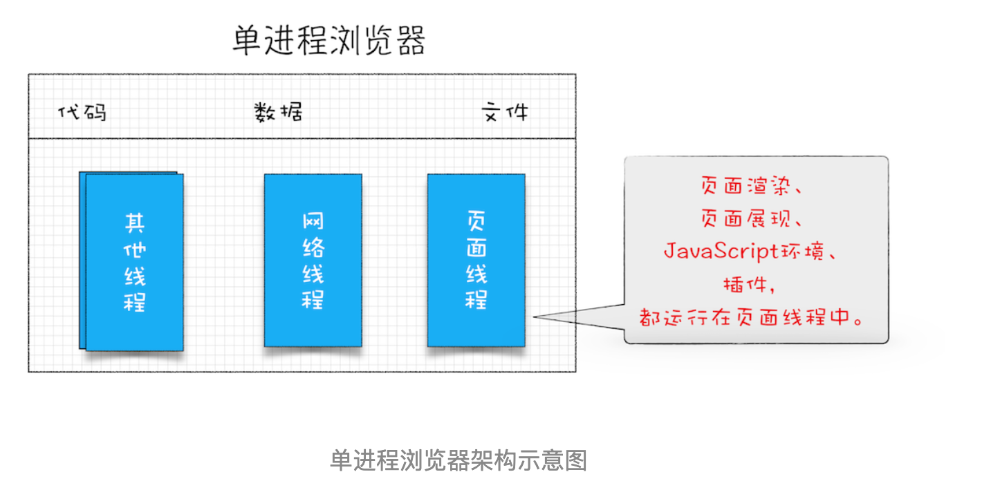
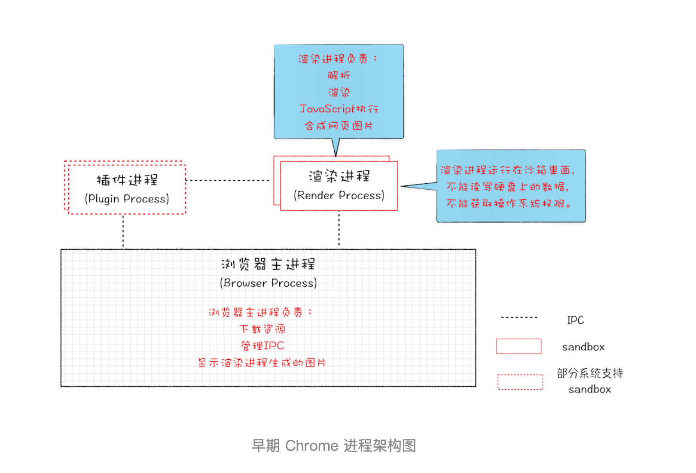
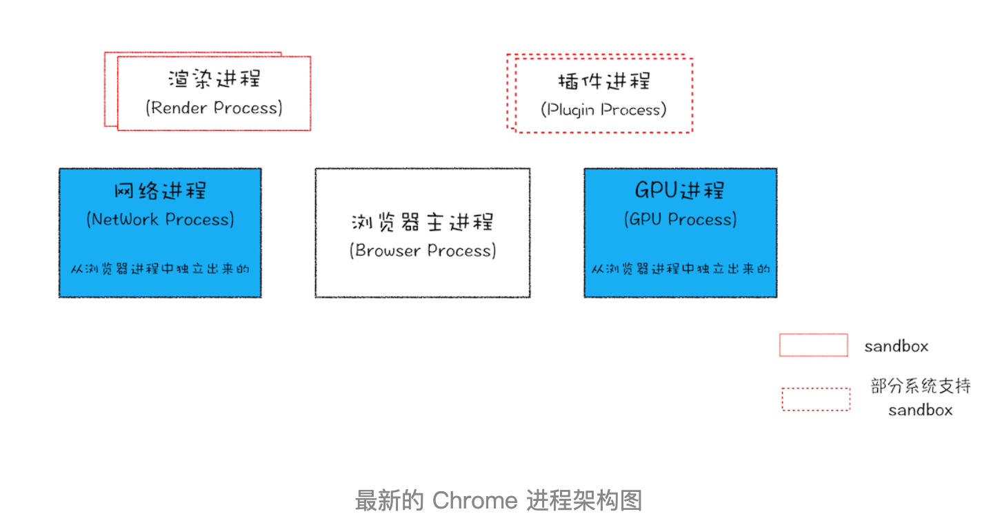
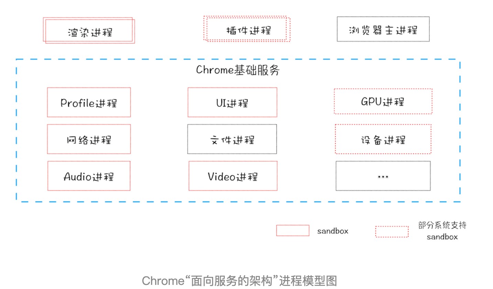
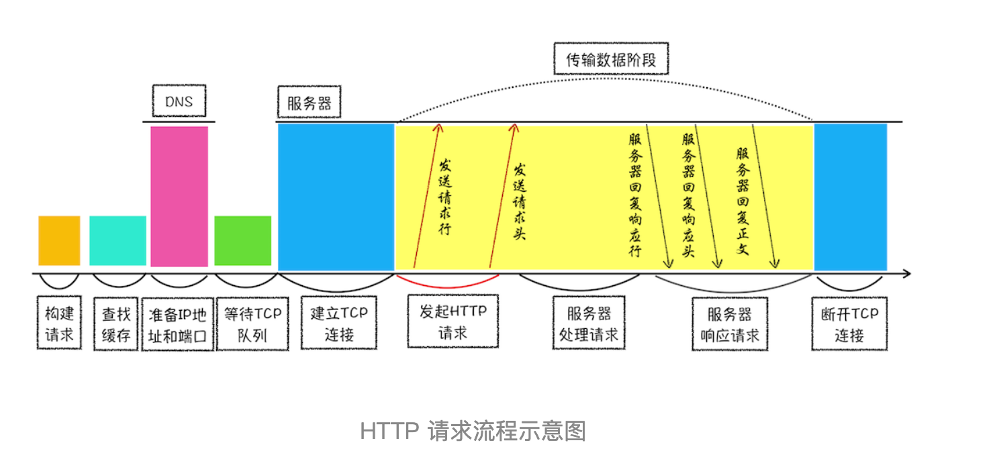
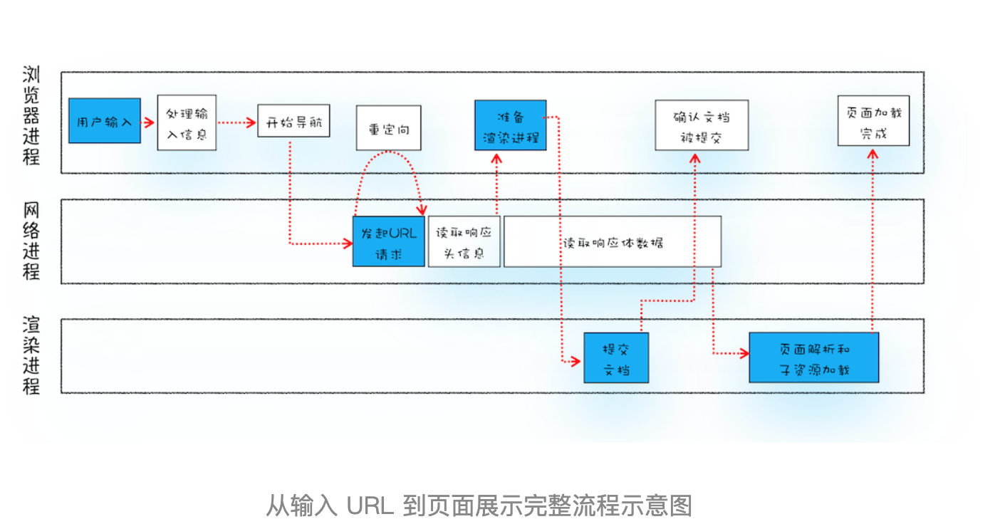
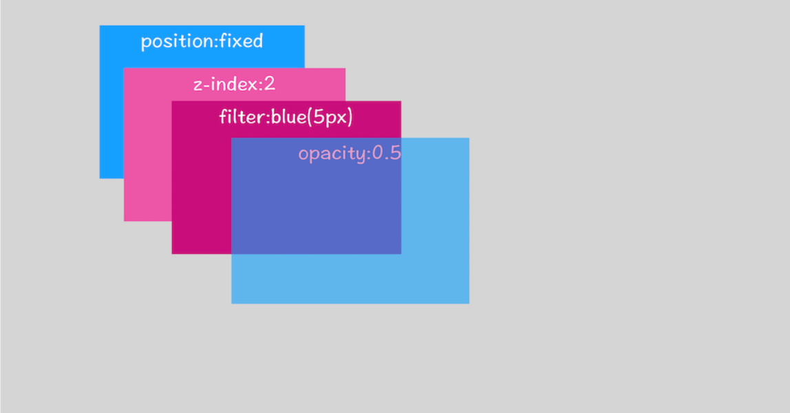
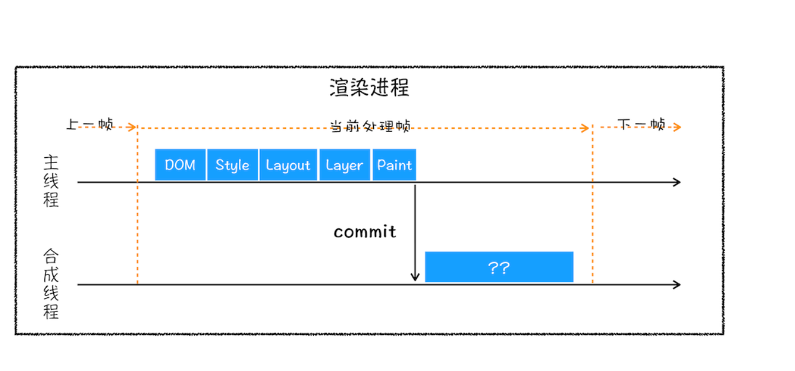
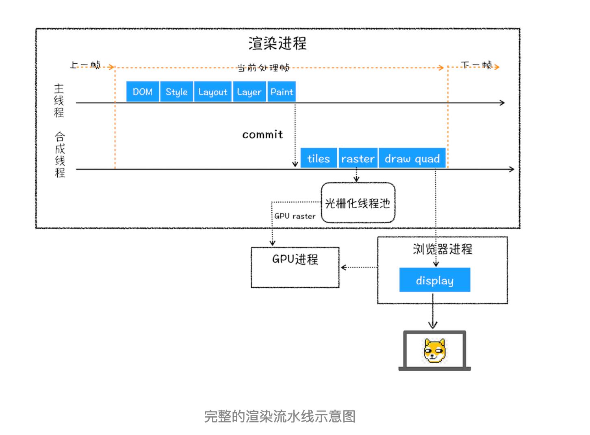

## 为什么需要学习浏览器工作原理

- 准确评估 Web 开发项目的可行性
- 从更高维度审视页面
    - 如果你要开发流畅的页面，或者诊断 Web 页面中的性能问题，那你就需要了解 URL 是怎么变成页面的，只有弄懂这些之后，你才可以站在全局的角度定位问题或者写出高效的代码。
    - 如果你对黑盒一无所知，你倒依然可以写前端代码，也可以使用很多最佳实践的策略来优化代码，这就如同不了解操作系统的工作原理同样可以在操作系统上写应用一样。
    - 但如果你理解了这个黑盒子是如何工作的，那情况就不同了。你可以 **站在更高的维度**审视你的项目，通过全视野快速定位项目中不合理的地方。比如，首屏的显示就涉及了 DNS、HTTP、DOM 解析、CSS 阻塞、JavaScript 阻塞等技术因素，其中一项没处理好就可能导致整个页面的延时。
- 在快节奏的技术迭代中 把握本质
- 总之：了解浏览器是如何工作的，能让你站在更高维度去理解前端

## 宏观视角下的浏览器
### Chrome架构：仅仅打开了1个页面，为什么有4个进程？  多进程架构

选项 - 更多工具 - 任务管理器

> 无论你是想要设计高性能 Web 应用，还是要优化现有的 Web 应用，你都需要了解浏览器中的网络流程、页面渲染过程，JavaScript 执行流程，以及 Web 安全理论，而这些功能是分散在浏览器的各个功能组件中的，比较多、比较散，要怎样学习才能掌握呢？通过浏览器的多进程架构的学习，你就可以把这些分散的知识点串起来，组成一张网，从而让自己能站在更高的维度去理解 Web 应用。

- 线程 & 进程

1. 线程是不能单独存在的，它是由进程来启动和管理的。线程是依附于进程的，而进程中使用多线程并行处理能提升运算效率。
2. 进程就是一个程序的运行实例。详细解释就是，启动一个程序的时候，操作系统会为该程序创建一块内存，用来存放代码、运行中的数据和一个执行任务的主线程，我们把这样的一个运行环境叫进程。

- 线程 & 进程 关系

1. 进程中的任意一线程执行出错，都会导致整个进程的崩溃
2. 线程之间共享进程中的数据
3. 当一个进程关闭之后，操作系统会回收进程所占用的内存。
4. 进程之间的内容相互隔离。

#### 2007 年之前，市面上浏览器都是单进程的
如此多的功能模块运行在一个进程里，是导致单进程浏览器 **不稳定、不流畅和不安全** 的一个主要因素



#### 早期多进程架构


多进程架构解决的问题

- **解决不稳定**：由于进程是相互隔离的，所以当一个页面或者插件崩溃时，影响到的仅仅是当前的页面进程或者插件进程，
- **解决不流畅**：JavaScript 也是运行在渲染进程中的，所以即使 JavaScript 阻塞了渲染进程，影响到的也只是当前的渲染页面，而并不会影响浏览器和其他页面
- **解决不安全**: 使用 **安全沙箱**（你可以把沙箱看成是操作系统给进程上了一把锁，沙箱里面的程序可以运行，但是不能在你的硬盘上写入任何数据，也不能在敏感位置读取任何数据，例如你的文档和桌面），Chrome 把插件进程和渲染进程锁在沙箱里面，这样即使在渲染进程或者插件进程里面执行了恶意程序，恶意程序也无法突破沙箱去获取系统权限

#### 现在的多进程架构


最新的浏览器包括：

1. **一个浏览器主进程**：主要负责界面显示、用户交互、子进程管理，同时提供存储等功能。
2. **一个GPU进程**：其实，Chrome 刚开始发布的时候是没有 GPU 进程的。而 GPU 的使用初衷是为了实现 3D CSS 的效果，只是随后网页、Chrome 的 UI 界面都选择采用 GPU 来绘制，这使得 GPU 成为浏览器普遍的需求。最后，Chrome 在其多进程架构上也引入了 GPU 进程。

3. **1 个网络（NetWork）进程**：主要负责页面的网络资源加载，之前是作为一个模块运行在浏览器进程里面的，直至最近才独立出来，成为一个单独的进程。
4. **多个渲染进程**：核心任务是将 HTML、CSS 和 JavaScript 转换为用户可以与之交互的网页，**排版引擎 Blink** 和 **JavaScript引擎 V8** 都是运行在该进程中，默认情况下，Chrome 会为每个 Tab 标签创建一个渲染进程。出于安全考虑，渲染进程都是运行在沙箱模式下。
5. **多个插件进程**：主要是负责插件的运行，因插件易崩溃，所以需要通过插件进程来隔离，以保证插件进程崩溃不会对浏览器和页面造成影响。
6. **V8代理解析工具**进程？？？（最近又单独分出来的么）

多进程模型提升了浏览器的稳定性、流畅性和安全性，但是同时也带来了一些问题：

- **更高的资源占用**。因为每个进程都会包含公共基础结构的副本（如 JavaScript 运行环境），这就意味着浏览器会消耗更多的内存资源。
- **更复杂的体系架构**。浏览器各模块之间耦合性高、扩展性差等问题，会导致现在的架构已经很难适应新的需求了

对于上面这两个问题，Chrome 团队一直在寻求一种弹性方案，既可以解决资源占用高的问题，也可以解决复杂的体系架构的问题。

#### 未来面向服务的架构（SOA）

>Chrome 整体架构会朝向现代操作系统所采用的“面向服务的架构” 方向发展，原来的各种 **模块会被重构成独立的服务**（Service），每个服务（Service）都可以在独立的进程中运行，访问服务（Service）必须使用定义好的接口，通过 IPC 来通信，从而构建一个更内聚、松耦合、易于维护和扩展的系统。
Chrome 最终要把 UI、数据库、文件、设备、网络等模块重构为基础服务，类似操作系统底层服务。


同时 Chrome 还提供灵活的弹性架构，在强大性能设备上会以多进程的方式运行基础服务，但是如果在资源受限的设备上（如下图），Chrome 会将很多服务整合到一个进程中，从而节省内存占用。


### Question:为什么单个页面卡死最终崩溃导致所有页面崩溃的情况?
通常情况下是一个页面使用一个进程，但是，有一种情况，叫"同一站点(same-site)"，具体地讲，我们将“同一站点”定义为根域名（例如，geekbang.org）加上协议（例如，https:// 或者http://），还包含了该根域名下的所有子域名和不同的端口。几个页面符合同一站点，那么他们将被分配到一个渲染进程里面去。

## 02 | TCP协议：如何保证页面文件能被完整送达浏览器？
在网络中，一个文件通常会被拆分为很多数据包来进行传输，而数据包在传输过程中又有很大概率丢失或者出错。那么如何保证页面文件能被完整地送达浏览器呢？
互联网中的数据是通过数据包来传输的，数据包在传输过程中容易丢失或出错。

- IP 负责把数据包送达目的主机。
- UDP 负责把数据包送达具体应用。
- 而 TCP 保证了数据完整地传输，它的连接可分为三个阶段：建立连接、传输数据和断开连接

## 03丨HTTP请求流程：为什么很多站点第二次打开速度会很快？

HTTP请求流程示意图：


1. 构建请求
2. 查找缓存
3. 准备 IP 地址和端口（DNS解析）
4. 等待 TCP 队列（同一个域名同时最多只能建立 6 个 TCP 连接）
5. 建立 TCP 连接
6. 发送 HTTP 请求
7. 服务器端处理 HTTP 请求流程
8. 服务器返回请求和断开连接

## 导航流程：从输入URL到页面展示，这中间发生了什么？

“在浏览器里，从输入 URL 到页面展示，这中间发生了什么？ ”这是一道经典的面试题，能比较全面地考察应聘者知识的掌握程度，其中涉及到了网络、操作系统、Web 等一系列的知识。

**整个过程需要浏览器各个进程之间的配合**
先看下三个进程的职责：

- **浏览器进程**主要负责用户交互、子进程管理和文件储存等功能。
- **网络进程**是面向渲染进程和浏览器进程等提供网络下载功能。
- **渲染进程**的主要职责是把从网络下载的 HTML、JavaScript、CSS、图片等资源解析为可以显示和交互的页面。因为渲染进程所有的内容都是通过网络获取的，会存在一些恶意代码利用浏览器漏洞对系统进行攻击，所以运行在渲染进程里面的代码是不被信任的。这也是为什么 Chrome 会让渲染进程运行在安全沙箱里，就是为了保证系统的安全。

用户发出 URL 请求到页面开始解析的这个过程，就叫做 **导航**。如果你理解了导航流程，那么你就能完整串起来整个页面显示流程，这对于你理解浏览器的工作原理起到了点睛的作用。

1. **用户输入**
    判断输入的内容是搜索内容还是url
    
        - 如果是搜索内容 则使用浏览器默认的搜索引擎来合成带搜索关键字的url
        - 如果符合 URL 规则,加上协议合成完整的url
    回车，icon编程loading，但是页面没变，等到提交文档阶段才会变。

2. **URL请求过程**

浏览器进程通过进程间通信（IPC）把url发送到网络进程，网络进程收到url发起真正的请求流程。

网络进程查找本身是否有缓存，有缓存直接返回资源给浏览器进程。

没有缓存则进入网络请求，


	1. DNS解析获取IP地址，如果是HTTPS还要建立TLS连接。
	2. 利用IP地址和服务器建立TCP连接
	3. 浏览器端构建请求行请求头等信息把该域名下cookie附带请求头中像服务器发起构建请求
	4. 服务器收到请求信息后，根据请求信息生成相应数据并发给网络进程
	5. 网络进程接收到响应后  
	    - **开始解析响应头的内容** 解析到响应头是301或302，网络进程会从响应头的 Location 字段里面读取 **重定向**的地址，然后再发起新的 HTTP 或者 HTTPS 请求。 200继续处理该请求。
	    - **响应数据类型处理** 浏览器根据 **Content-Type**来决定如何响应请求体内容，不同type响应不同，
	        - application/octet-stream判断为下载类型，请求会被提交给下载管理器，流程结束
	        - text/html 如果是HTML，那么浏览器则会继续进行导航流程。进入下一个阶段

3. **准备渲染进程**

	打开一个新的页面一般会使用单独的渲染进程

	默认情况下Chrome 会为每个页面分配一个渲染进程，如果从一个页面打开了另一个新页面，而新页面和当前页面属于同一站点（同一站点 根域名和协议一直的情况下）的话，那么新页面会复用父页面的渲染进程。 process-per-site-instance策略。

	渲染进程准备好之后不能马上解析文档，这时文档数据还在网络进程中并没有提交给渲染进程。下一步 提交文档阶段。
4. **提交文档阶段** 文档指响应体数据。
	
	- 浏览器进程发出 **提交文档** 的信息给渲染进程，渲染进程和网络进程建立“管道”。
	- 文档传输完， 渲染进程给浏览器进程返回 **确认提交**的消息
- 浏览器进程收到消息 更新界面内容 （安全状态、地址栏的 URL、前进后退的历史状态，并更新 Web 页面）
	
5. **渲染阶段**
一旦文档被提交，渲染进程便开始页面解析和子资源加载了。

## 渲染流程（上）：HTML、CSS和JavaScript，是如何变成页面的？


渲染模块经过一系列渲染流水线,处理，最后生成像素。

1. **构建DOM树**
	将HTML转化为浏览器可以理解的DOM树
	
2. **计算样式**（Recalculate Style）：计算每个元素的具体样式
	
	1. 将css转化为浏览器可以理解的styleSheets
	2. 转化属性值，使其标准化 (red 被解析成了 rgb(255,0,0)，bold 被解析成了 700)
	3. 计算出每个节点的具体样式
		- 样式继承
		- 样式层叠
	
3. **布局阶段** layout

	有了DOM和DOM树中的元素样式还不能显示，还需要计算DOM树可见元素的具体位置。
	1. **创建布局树  layoutree** 
	
		显示之前额外创建一颗只包含可见元素的布局树
	2. **布局计算**
		计算布局上节点的坐标位置，把布局运算结果重新放到布局树中。这是布局阶段**不合理**的地方。布局阶段并没有清晰地将输入内容和输出内容区分开来。
	
		**chrome正在重构布局代码，下一代布局系统叫 LayoutNG，试图更清晰地分离输入和输出，从而让新设计的布局算法更加简单。**
		
		**？？我记得DOM树和CSSOM树并行构建合成渲染树？？**
		
			源码中没有CSSOM这个词，渲染树也是16年之前的东西，现在的代码完全重构了，你可以把LayoutTree看成是渲染树，不过和之前的渲染树还是有一些差别的。
	
4. **分层** （开发中工具中的Layers）
    有了布局树还不能绘制，有一些复杂的3D转换，页面滚动，或者使用 z-indexing 做 z 轴排序等。**渲染引擎还需要为特定的节点生成专用的图层，并生成一棵对应的图层树（LayerTree）** 

  渲染引擎给页面分了很多图层，这些图层按照一定顺序叠加在一起，就形成了最终的页面。

  并不是所有节点都能成为独立的层。如果一个节点没有对应的层，就会从属于父节点的图层。

  **什么样的节点才会生成独立的层？？满足一下任意一点**
  	1. 拥有层叠上下文属性的元素会被提升为单独的一层。

    页面是个二维平面，但是层叠上下文能够让 HTML 元素具有三维概念

  ```
  （定位属性的元素、定义透明属性的元素、使用 CSS 滤镜的元素）
  ```

  

  2. 需要剪裁（clip）的地方也会被创建为图层

  比如限定宽高的div中文字超出。渲染引擎会为文字部分单独创建一个层，如果出现滚动条，滚动条也会被提升为单独的层。

5. **图层绘制**

  对图层树中的每个图层进行绘制

  渲染引擎会把一个图层的绘制拆分成很多小的绘制指令，然后再把这些指令按照顺序组成一个待绘制列表。

  

6. **分块**

7. **栅格化（raster）操作**（将图块生成位图）

  绘制列表只是用来记录绘制顺序和绘制指令的列表，而实际上绘制操作是由渲染引擎中的**合成线程**来完成的
  
  当绘制列表准备好后，主线程将其提交到合成线程。

  **合成线程如何工作？**
  有些页面很长假如一开始就绘制出所有内容开销很大。
  基于此，**合成线程会将图层划分为图块（tile）**，256x256 或512x512。优先将视口附近的**图块**生成**位图**,生成位图的操作是由`栅格化`来执行的。所谓栅格化，是指将图块转换为位图。渲染进程维护了一个栅格化的线程池，所有的图块栅格化都是在线程池内执行的。

  通常栅格化过程都会使用 GPU 来加速生成，生成的位图被保存在 GPU 内存中。既然是GUP操作的肯定就是在`GPU进程`中完成的,就涉及到跨进程操作。

  总之：渲染进程把生成图块的指令发送给 GPU，然后在 GPU 中执行生成图块的位图，并保存在 GPU 的内存中。

8. **合成**
    一旦所有图块都被光栅化，合成线程就会生成一个绘制图块的命令——“DrawQuad”，然后将该命令提交给浏览器进程。

浏览器进程里面有一个叫 viz 的组件，用来接收合成线程发过来的 DrawQuad 命令，然后根据 DrawQuad 命令，将其页面内容绘制到内存中，最后再将内存显示在屏幕上。

整个渲染过程


#### 渲染过程总结：

1. 渲染进程将 HTML 内容转换为能够读懂的**DOM Tree**结构。
2. 渲染引擎将 CSS 样式表转化为浏览器可以理解的**styleSheets**，计算出 DOM 节点的样式。
3. 创建布局树，并计算元素的布局信息。**layoutTree**
4. 对布局树进行分层，并生成分层树。**LayerTree**
5. 为每个图层生成绘制列表，并将其提交到合成线程。**paint**
6. 合成线程将图层分成图块，并在光栅化线程池中将 **图块**转换成 **位图**。
7. 合成线程发送绘制图块命令DrawQuad给浏览器进程。
8. 浏览器进程根据 DrawQuad 消息生成页面，并显示到显示器上。 **display**

**重排：**

**重绘**重绘省去了布局和分层阶段，所以执行效率会比重排操作要高一些。

**直接合成阶段**：不要布局也不要绘制的属性，渲染引擎将跳过布局和绘制，只执行后续的合成操作，我们把这个过程叫做合成。
我们使用了 CSS 的 transform 来实现动画效果，这可以避开重排和重绘阶段，直接在非主线程上执行合成动画操作。这样的效率是最高的，因为是在非主线程上合成，并没有占用主线程的资源，另外也避开了布局和绘制两个子阶段，所以相对于重绘和重排，合成能大大提升绘制效率


